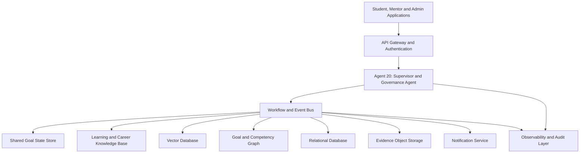
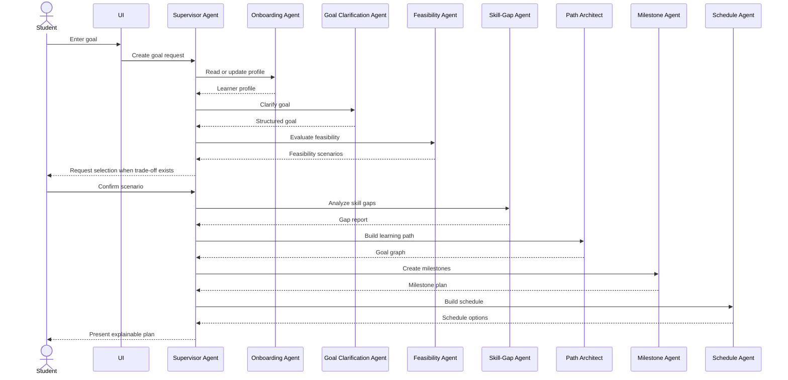
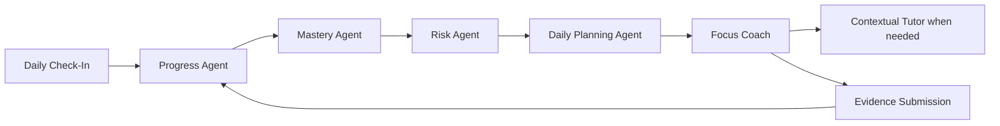
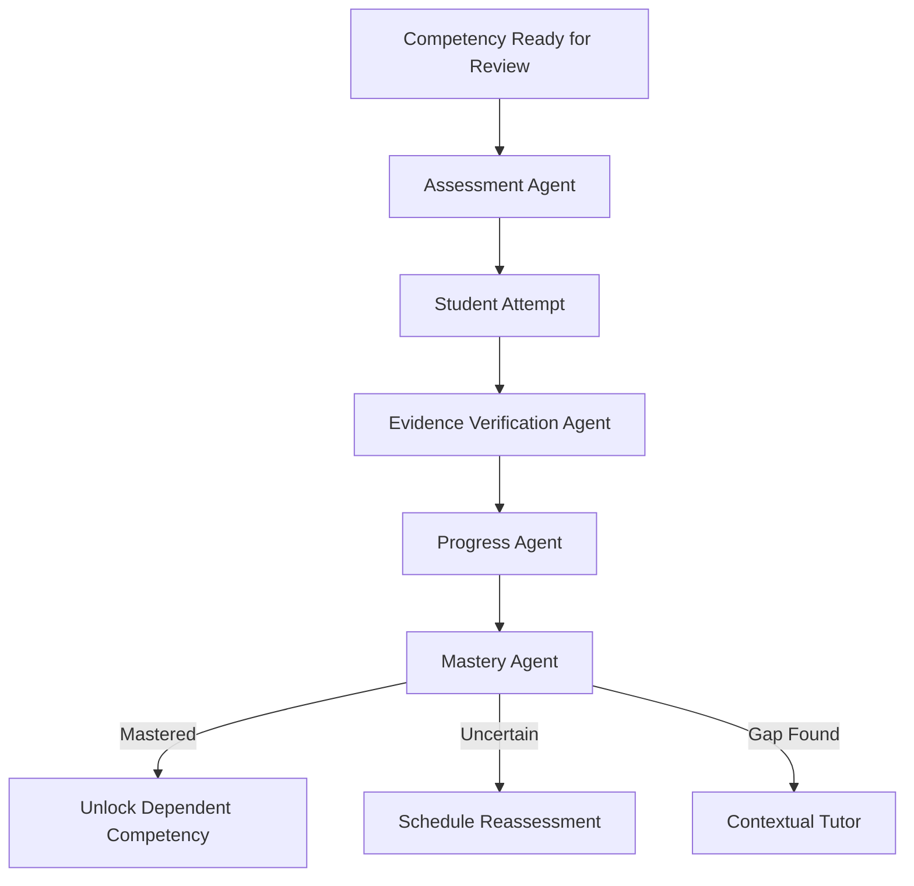
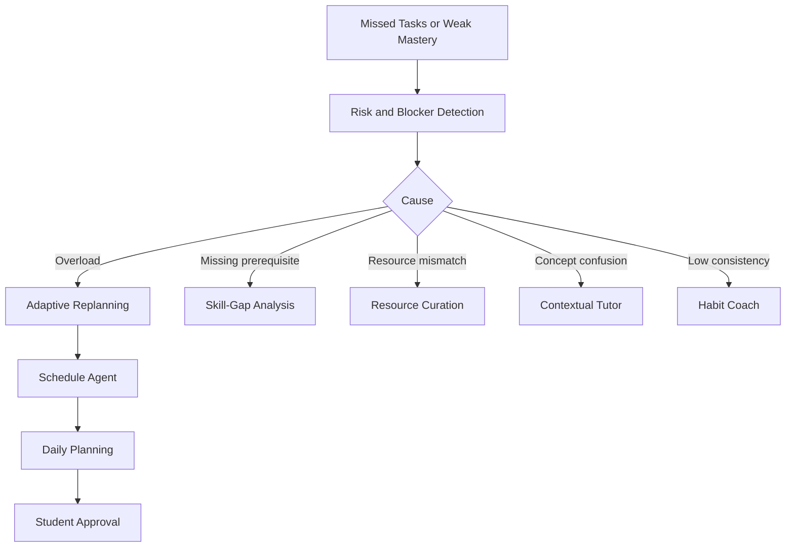
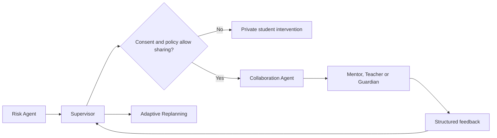
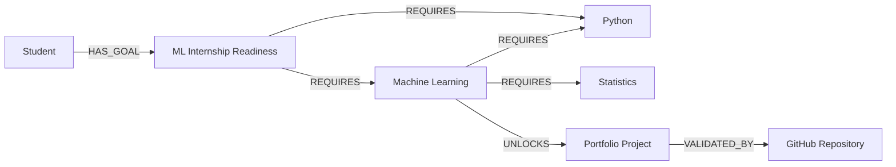

# AstraPath
## Agentic Student Goal Planning, Learning Guidance, and Achievement Platform

**Document type:** Product and implementation architecture  
**Version:** 1.0  
**Status:** Proposed MVP-to-Production Blueprint  
**Primary users:** Students, mentors, teachers, parents, academic coordinators, and training organizations

---

## 1. Executive Summary

AstraPath is an agent-based student success platform that helps a learner convert a broad ambition into a realistic, measurable, and continuously adapting achievement plan.

A student may enter a goal such as:

- “Become ready for a machine learning internship in six months.”
- “Score above 90% in my final examinations.”
- “Complete the AWS AI Practitioner certification.”
- “Build and publish a computer vision project.”
- “Improve my communication skills before placement season.”
- “Prepare for GATE while attending college.”

The system does not stop after generating a one-time roadmap. It creates a living **Goal Achievement System** around the student.

AstraPath:

1. Understands the student’s goal, background, available time, strengths, limitations, and preferred learning style.
2. Checks whether the goal is realistic and identifies missing prerequisites.
3. Converts the goal into competencies, milestones, weekly outcomes, daily tasks, assessments, and evidence.
4. Guides the learner during execution through tutoring, focus coaching, reminders, motivation, and blocker resolution.
5. Measures progress using demonstrated evidence rather than task completion alone.
6. Detects delay, overload, confusion, low confidence, weak mastery, and disengagement.
7. Replans the roadmap without losing the original objective.
8. Escalates important issues to a teacher, mentor, or parent only when appropriate and authorized.
9. Explains every important recommendation and preserves student control.

The proposed architecture contains **20 specialized agents** coordinated by a central Supervisor and Governance Agent. These agents operate through controlled workflows, shared state, structured data contracts, and explicit safety rules.

---

# 2. Problem Statement

Students frequently struggle not because they lack ambition, but because they face one or more of the following problems:

- Their goals are vague or too broad.
- They do not know the prerequisites.
- They copy generic roadmaps that do not match their current level.
- They underestimate the time required.
- They create schedules that conflict with college, work, travel, or health constraints.
- They consume resources without demonstrating mastery.
- They complete tasks but cannot apply the learned concepts.
- They lose momentum after missing a few days.
- They do not know when to revise the plan.
- They receive too much advice and too little actionable guidance.
- Teachers and parents see results late, after the student has already fallen behind.
- Existing learning platforms optimize content consumption rather than goal achievement.

AstraPath is designed to solve the complete journey:

> **Goal definition → feasibility → skill-gap discovery → planning → execution → assessment → mastery → adaptation → achievement**

---

# 3. Product Vision

## 3.1 Vision Statement

Create a trusted AI achievement companion that helps every student understand where they are, decide where they want to go, and follow the most suitable path to reach that destination.

## 3.2 Mission

Transform student planning from a static timetable into an evidence-driven, personalized, adaptive, and mentor-aware achievement system.

## 3.3 Product Promise

AstraPath should always help the student answer five questions:

1. **What am I trying to achieve?**
2. **What should I do next?**
3. **Why is this task important?**
4. **Am I actually improving?**
5. **What should change when I fall behind?**

---

# 4. Unique Value Proposition

AstraPath is not only a planner, chatbot, learning management system, or habit tracker. Its uniqueness comes from combining the following capabilities.

## 4.1 Goal-to-Evidence Planning

Every goal is converted into:

- Target outcomes
- Required competencies
- Prerequisite skills
- Milestones
- Learning activities
- Practice activities
- Assessments
- Evidence requirements
- Completion criteria

The system does not consider a topic mastered merely because the student watched a video or checked a task.

## 4.2 Dynamic Goal Graph

The learner’s plan is represented as a graph:

```text
Goal
 ├── Outcome
 │    ├── Competency
 │    │    ├── Concept
 │    │    ├── Practice
 │    │    ├── Assessment
 │    │    └── Evidence
 │    └── Milestone
 └── Constraint
```

Dependencies can be recalculated when the goal, deadline, or student profile changes.

## 4.3 Mastery-Based Progress

Progress is calculated from multiple signals:

- Quiz performance
- Project evidence
- Explanation quality
- Practice consistency
- Error patterns
- Recall after time gaps
- Confidence calibration
- Mentor validation
- Task completion

## 4.4 Adaptive Recovery Instead of Punishment

When a student falls behind, the system does not simply mark tasks as overdue. It identifies why:

- Plan was too ambitious
- Prerequisites were missing
- Student lacked time
- Resource was unsuitable
- Topic was misunderstood
- Motivation declined
- External disruption occurred

It then produces a recovery plan.

## 4.5 Energy-Aware and Constraint-Aware Scheduling

The schedule considers:

- Class timetable
- Examinations
- Commute
- Work or internship
- Sleep preference
- High-focus hours
- Device and internet availability
- Accessibility requirements
- Maximum study load
- Personal commitments

## 4.6 Evidence Portfolio

Students build an achievement portfolio while learning:

- Notes
- Mini-projects
- GitHub commits
- Certificates
- Quiz results
- Written explanations
- Presentation recordings
- Mentor feedback
- Reflection logs

This helps the learner prove capability to teachers, recruiters, or evaluators.

## 4.7 Human-in-the-Loop Support

The platform can involve mentors, teachers, parents, or coordinators with student consent. Human users receive meaningful summaries rather than raw surveillance data.

## 4.8 Explainable Recommendations

Every major plan change should answer:

- What changed?
- Why did it change?
- Which evidence triggered it?
- What alternatives were considered?
- How can the student override it?

---

# 5. Scope

## 5.1 MVP Scope

The MVP should support:

- Student onboarding
- Goal creation
- Feasibility analysis
- Skill-gap analysis
- Goal decomposition
- Milestone creation
- Weekly planning
- Daily task generation
- Resource recommendation
- Focus sessions
- Tutor assistance
- Quiz generation
- Evidence upload
- Progress tracking
- Risk detection
- Adaptive replanning
- Student dashboard
- Mentor dashboard
- Notifications
- Explainable agent actions

## 5.2 Post-MVP Scope

Later releases may support:

- Institution-wide cohorts
- Course integration
- Calendar integration
- GitHub integration
- LMS integration
- Voice coaching
- Mobile application
- Peer learning groups
- Career opportunity matching
- Internship readiness scoring
- Placement preparation tracks
- Learning disability accommodations
- Multilingual tutoring
- Offline-first learning packs
- Scholarship and certification discovery

## 5.3 Out of Scope for Initial MVP

- Automatic academic grading for official institutional records
- Diagnosing mental-health or medical conditions
- Disciplinary surveillance
- High-stakes admission decisions
- Fully autonomous communication with guardians without consent
- Replacing teachers, counselors, or qualified professionals
- Generating fraudulent academic submissions

---

# 6. Core Design Principles

1. **Student agency:** The student remains the final decision-maker.
2. **Evidence over activity:** Mastery requires proof, not only attendance.
3. **Controlled agent workflows:** Agents operate through explicit contracts.
4. **Explainability:** Important actions are traceable.
5. **Privacy by design:** Collect only necessary data.
6. **Safety by default:** Detect harmful or inappropriate requests.
7. **Human escalation:** Involve humans for high-impact decisions.
8. **Progressive personalization:** Start simple and learn preferences gradually.
9. **Graceful recovery:** Missing a day should not destroy the plan.
10. **No fabricated progress:** The system must not invent completed tasks, scores, or evidence.
11. **Age-aware experience:** Younger students require stricter consent and safety.
12. **Accessible interaction:** Support varied learning and accessibility needs.

---

# 7. User Roles

## 7.1 Student

Can:

- Create and manage goals
- View plans
- Complete tasks
- Start focus sessions
- Ask questions
- Take assessments
- Submit evidence
- Reflect on progress
- Accept or reject plan changes
- Control data-sharing permissions

## 7.2 Mentor or Teacher

Can, when authorized:

- Review progress summaries
- Add recommendations
- Validate evidence
- Adjust milestones
- Approve major plan changes
- Respond to escalated blockers

## 7.3 Parent or Guardian

Can, when authorized and age-appropriate:

- View limited progress summaries
- See important schedule or support requests
- Receive selected risk notifications
- Encourage consistency without accessing private student conversations

## 7.4 Academic Coordinator

Can:

- Create goal templates
- Review cohort-level anonymized metrics
- Assign mentors
- Configure institutional policies
- Monitor system quality

## 7.5 Platform Administrator

Can:

- Manage models, policies, integrations, and access
- Review system health
- Audit agent decisions
- Investigate failures
- Manage safety and privacy controls

---

# 8. High-Level System Architecture



## 8.1 Architectural Style

Recommended architecture:

- Modular monolith for the first MVP
- Event-driven internal workflows
- Agent modules implemented as deterministic Python services
- Structured LLM calls only where reasoning or language generation is required
- Background workers for long-running workflows
- REST or GraphQL APIs for client applications
- PostgreSQL for transactional data
- Neo4j for goal, competency, and prerequisite relationships
- Qdrant or PostgreSQL with pgvector for semantic retrieval
- S3-compatible storage for evidence files
- Redis for caching, workflow locks, and queues
- Celery, Dramatiq, Temporal, or Prefect for workflow execution
- OpenTelemetry for traces
- Human approval checkpoints for high-impact actions

For a student team or initial academic prototype, a modular Python architecture is preferred over a complex multi-agent framework. LangGraph, PydanticAI, or another orchestration framework may be introduced after the contracts are stable.

---

# 9. System Layers

## Layer 1 — Experience Layer

- Web application
- Mobile application
- Student dashboard
- Mentor dashboard
- Focus mode
- Chat interface
- Notifications
- Calendar and timeline views

## Layer 2 — API and Identity Layer

- Authentication
- Authorization
- Consent
- User profile
- Session management
- Rate limiting
- Input validation

## Layer 3 — Agent Orchestration Layer

- Supervisor routing
- Workflow state machine
- Agent invocation
- Retry policy
- Human approval
- Conflict resolution
- Agent timeouts
- Cost controls

## Layer 4 — Intelligence Layer

- LLM reasoning
- Retrieval-augmented generation
- Goal classification
- Skill inference
- Mastery estimation
- Risk scoring
- Schedule optimization
- Recommendation ranking

## Layer 5 — Knowledge Layer

- Goal templates
- Competency ontology
- Prerequisite graph
- Academic resources
- Career paths
- Assessment banks
- Learning strategies
- Institutional rules

## Layer 6 — Data Layer

- Student profiles
- Goals
- Plans
- Tasks
- Sessions
- Assessments
- Evidence
- Progress events
- Agent decisions
- Consent records
- Audit logs

## Layer 7 — Trust and Operations Layer

- Safety policies
- Privacy controls
- Explainability
- Monitoring
- Evaluation
- Model registry
- Audit trails
- Incident response

---

# 10. Agent Architecture Overview

The system contains exactly **20 agents**.

| No. | Agent | Primary Responsibility |
|---:|---|---|
| 1 | Student Onboarding and Profile Agent | Build the initial learner profile |
| 2 | Goal Clarification Agent | Convert vague ambitions into measurable goals |
| 3 | Goal Feasibility Agent | Evaluate realism, constraints, and required trade-offs |
| 4 | Skill-Gap Analysis Agent | Identify current and missing competencies |
| 5 | Learning Path Architect Agent | Create the competency and prerequisite path |
| 6 | Milestone Decomposition Agent | Convert the path into measurable milestones |
| 7 | Resource Discovery and Curation Agent | Recommend safe and relevant learning resources |
| 8 | Schedule and Time-Budget Agent | Fit the plan into the learner’s real availability |
| 9 | Daily Action Planning Agent | Generate actionable daily tasks |
| 10 | Focus Session Coach Agent | Guide active study or work sessions |
| 11 | Contextual Tutor Agent | Explain concepts and resolve questions |
| 12 | Assessment Generation Agent | Generate quizzes, exercises, and demonstrations |
| 13 | Evidence Verification Agent | Validate submitted work and completion evidence |
| 14 | Progress Tracking Agent | Calculate plan execution progress |
| 15 | Mastery Estimation Agent | Estimate real competency development |
| 16 | Motivation and Habit Coach Agent | Support consistency and reflection |
| 17 | Risk and Blocker Detection Agent | Detect delay, overload, confusion, and disengagement |
| 18 | Adaptive Replanning Agent | Revise the plan using current evidence |
| 19 | Mentor and Stakeholder Collaboration Agent | Manage authorized human collaboration |
| 20 | Supervisor and Governance Agent | Orchestrate, govern, audit, and resolve conflicts |

---

# 11. Standard Agent Contract

Every agent should implement a common interface.

```python
from typing import Protocol
from pydantic import BaseModel

class AgentContext(BaseModel):
    workflow_id: str
    student_id: str
    goal_id: str | None = None
    actor_role: str
    consent_scope: list[str]
    correlation_id: str
    request_timestamp: str

class AgentResult(BaseModel):
    agent_name: str
    status: str
    confidence: float
    summary: str
    data: dict
    evidence_ids: list[str] = []
    warnings: list[str] = []
    next_actions: list[str] = []
    requires_human_review: bool = False

class Agent(Protocol):
    async def execute(
        self,
        context: AgentContext,
        input_data: dict
    ) -> AgentResult:
        ...
```

## 11.1 Required Agent Behaviors

Each agent must:

- Validate input schema
- Check authorization and consent
- Read only the required student data
- Return structured output
- Provide a confidence score
- Include evidence references
- Declare assumptions
- Avoid modifying unrelated state
- Write an audit event
- Support idempotency
- Return warnings instead of silently failing
- Request human review when confidence is too low
- Avoid presenting unsupported claims as facts

---

# 12. Detailed Specifications for the 20 Agents

---

## Agent 1 — Student Onboarding and Profile Agent

### Purpose

Create an initial learner profile that is useful for planning without collecting unnecessary personal data.

### Responsibilities

- Collect education level and relevant background
- Record current skills and prior experience
- Capture preferred learning formats
- Record available devices and internet access
- Capture weekly availability
- Identify accessibility requirements
- Record major fixed commitments
- Ask for the student’s preferred level of challenge
- Store communication and notification preferences
- Record consent for mentor or parent sharing

### Inputs

- Registration details
- Onboarding questionnaire
- Optional diagnostic test
- Optional résumé, marksheet, portfolio, or course history
- Calendar availability
- Consent settings

### Outputs

```json
{
  "student_profile_id": "sp_001",
  "education_level": "undergraduate",
  "current_competencies": [],
  "weekly_time_budget_minutes": 720,
  "preferred_learning_modes": ["projects", "visual_explanations"],
  "constraints": [],
  "support_preferences": {},
  "consent_policy_id": "cp_001",
  "profile_confidence": 0.78
}
```

### Decision Rules

- Do not infer sensitive traits unnecessarily.
- Mark self-reported skills separately from assessed skills.
- Do not force a learning-style label as a scientific fact.
- Ask the student to confirm inferred constraints.
- Create a minimal profile when the student skips optional questions.

### Trigger

- New account
- Profile update
- Significant schedule change
- New education stage

### Human Review

Not normally required unless institutional policy requires guardian consent.

---

## Agent 2 — Goal Clarification Agent

### Purpose

Convert an ambiguous goal into a specific goal definition.

### Example

Input:

> “I want to learn machine learning.”

Clarified goal:

> “Build and publish two beginner-to-intermediate machine learning projects and become interview-ready for an entry-level internship by January 31, 2027.”

### Responsibilities

- Identify goal category
- Capture expected outcome
- Capture deadline
- Define success criteria
- Identify motivation
- Identify mandatory and optional outcomes
- Separate learning goals from performance goals
- Identify external requirements such as exam syllabus or certification blueprint
- Generate goal alternatives when the request is unrealistic or incomplete

### Inputs

- Student goal statement
- Student profile
- Optional target role, examination, course, or certification
- Deadline and priority

### Outputs

```json
{
  "goal_id": "goal_001",
  "goal_title": "Machine Learning Internship Readiness",
  "goal_type": "career_readiness",
  "target_date": "2027-01-31",
  "success_criteria": [
    "Complete required foundations",
    "Publish two reviewed projects",
    "Pass a mock technical interview"
  ],
  "mandatory_outcomes": [],
  "optional_outcomes": [],
  "student_motivation": "",
  "clarity_score": 0.91
}
```

### Guardrails

- Do not transform the student’s goal into a different goal without approval.
- Show assumptions clearly.
- Preserve the student’s language where possible.
- Avoid promising guaranteed scores, jobs, admissions, or certifications.

### Trigger

- New goal
- Goal edited
- Goal has low clarity
- Student asks to change direction

---

## Agent 3 — Goal Feasibility Agent

### Purpose

Evaluate whether the goal can reasonably be achieved under the current constraints.

### Responsibilities

- Estimate total effort
- Compare effort with available time
- Analyze prerequisite burden
- Identify deadline risk
- Detect conflicting goals
- Create feasibility scenarios
- Propose scope or deadline alternatives
- Explain key trade-offs
- Produce a confidence range rather than false precision

### Inputs

- Clarified goal
- Student profile
- Time availability
- Existing commitments
- Skill baseline
- Historical completion patterns

### Outputs

```json
{
  "feasibility_status": "challenging_but_possible",
  "estimated_effort_hours": {
    "minimum": 160,
    "expected": 220,
    "maximum": 300
  },
  "available_hours": 240,
  "major_risks": [],
  "recommended_adjustments": [],
  "scenario_options": [
    "Keep scope and increase weekly effort",
    "Keep weekly effort and extend deadline",
    "Reduce optional outcomes"
  ],
  "confidence": 0.76
}
```

### Feasibility Categories

- Feasible
- Feasible with constraints
- Challenging but possible
- Unlikely under current conditions
- Insufficient information
- Requires human review

### Guardrails

- Never discourage the student without alternatives.
- Do not present time estimates as guarantees.
- Distinguish external constraints from student ability.
- Avoid making judgments about intelligence or potential.

### Trigger

- Goal clarified
- Deadline changes
- Availability changes
- Major plan deviation

---

## Agent 4 — Skill-Gap Analysis Agent

### Purpose

Determine what the learner already knows and what must be learned.

### Responsibilities

- Map the goal to required competencies
- Read profile and diagnostic evidence
- Classify current proficiency
- Identify prerequisite gaps
- Identify transferable skills
- Mark uncertain inferences
- Recommend diagnostic assessments
- Create a gap priority list

### Inputs

- Goal definition
- Competency ontology
- Student self-assessment
- Past courses
- Quiz and project evidence
- Mentor validation

### Outputs

```json
{
  "required_competencies": [],
  "verified_competencies": [],
  "self_reported_competencies": [],
  "missing_competencies": [],
  "uncertain_competencies": [],
  "recommended_diagnostics": [],
  "gap_priority": []
}
```

### Proficiency Scale

- 0 — Not introduced
- 1 — Awareness
- 2 — Guided application
- 3 — Independent application
- 4 — Advanced application
- 5 — Can teach or design

### Guardrails

- Never equate low diagnostic performance with low potential.
- Keep assessment context.
- Allow the student to challenge incorrect classifications.

### Trigger

- Goal accepted
- New evidence submitted
- Assessment completed
- Mentor validates a skill

---

## Agent 5 — Learning Path Architect Agent

### Purpose

Build an ordered path of competencies and learning experiences.

### Responsibilities

- Create prerequisite-aware learning sequence
- Separate core and optional topics
- Select theory, practice, revision, and project stages
- Avoid redundant topics
- Add spaced review checkpoints
- Balance breadth and depth
- Create alternate paths where possible
- Produce a goal graph

### Inputs

- Skill-gap report
- Goal requirements
- Feasibility constraints
- Competency graph
- Resource availability
- Student preferences

### Outputs

```json
{
  "path_id": "path_001",
  "nodes": [],
  "dependencies": [],
  "core_path": [],
  "optional_branches": [],
  "review_cycles": [],
  "project_stages": [],
  "estimated_duration_weeks": 20
}
```

### Path Node Types

- Foundation
- Concept
- Guided practice
- Independent practice
- Project
- Assessment
- Revision
- Reflection
- Portfolio evidence
- Mentor review

### Guardrails

- Do not use only one source or one content format.
- Keep the path achievable under the time budget.
- Explain why prerequisites appear before advanced topics.

### Trigger

- Skill-gap report ready
- Major goal revision
- Replanning request
- New curriculum or certification requirements

---

## Agent 6 — Milestone Decomposition Agent

### Purpose

Convert the learning path into measurable outcomes.

### Responsibilities

- Create milestone hierarchy
- Assign acceptance criteria
- Define target dates
- Define dependencies
- Attach evidence requirements
- Define review checkpoints
- Separate output, outcome, and mastery milestones
- Add buffer for revision and recovery

### Inputs

- Learning path
- Goal deadline
- Time budget
- Risk profile
- Assessment strategy

### Outputs

```json
{
  "milestones": [
    {
      "milestone_id": "m_001",
      "title": "Complete Python Foundations",
      "target_date": "2026-09-15",
      "acceptance_criteria": [],
      "evidence_requirements": [],
      "dependencies": [],
      "status": "planned"
    }
  ]
}
```

### Milestone Quality Rules

A valid milestone must be:

- Specific
- Observable
- Time-bounded
- Evidence-backed
- Small enough to review
- Large enough to represent meaningful progress

### Trigger

- Learning path approved
- Plan regenerated
- Deadline adjusted

---

## Agent 7 — Resource Discovery and Curation Agent

### Purpose

Recommend high-quality resources that match the student, topic, budget, and device constraints.

### Responsibilities

- Search approved internal and external resource catalogs
- Rank resources by relevance
- Identify free and paid alternatives
- Check language and accessibility
- Detect broken or obsolete links
- Avoid duplicating equivalent resources
- Match content difficulty to proficiency
- Summarize why each resource is recommended
- Create resource bundles for offline use where licensing allows

### Inputs

- Competency node
- Student profile
- Device and bandwidth constraints
- Budget preference
- Resource quality metadata
- Mentor-approved sources

### Outputs

```json
{
  "resource_bundle_id": "rb_001",
  "primary_resource": {},
  "alternate_resources": [],
  "practice_resources": [],
  "reference_resources": [],
  "estimated_time_minutes": 180,
  "selection_explanation": ""
}
```

### Ranking Signals

- Alignment with competency
- Difficulty match
- Quality and authority
- Recency where relevant
- Accessibility
- Cost
- Student format preference
- Completion rate
- Mentor rating
- Prior student success

### Guardrails

- Do not recommend pirated content.
- Clearly label sponsored or institution-provided content.
- Do not fabricate citations, courses, books, or links.
- Use trusted-domain allowlists for younger learners.

### Trigger

- New plan node
- Resource rejected
- Resource unavailable
- Student asks for alternatives

---

## Agent 8 — Schedule and Time-Budget Agent

### Purpose

Create a realistic schedule around the student’s actual life.

### Responsibilities

- Read fixed commitments
- Calculate usable weekly capacity
- Place high-effort tasks in high-energy windows
- Create buffers
- Respect rest limits
- Avoid excessive consecutive sessions
- Resolve clashes
- Schedule reviews before assessments
- Preserve flexibility
- Generate multiple schedule options

### Inputs

- Milestones
- Weekly time budget
- Calendar availability
- Energy preferences
- Deadline
- Task estimates
- Institutional calendar

### Outputs

```json
{
  "schedule_id": "sch_001",
  "weekly_capacity_minutes": 720,
  "allocated_minutes": 630,
  "buffer_minutes": 90,
  "study_blocks": [],
  "conflicts": [],
  "schedule_health_score": 0.86
}
```

### Scheduling Constraints

- Maximum session length
- Minimum break duration
- Maximum daily load
- Sleep and class protection
- No silent calendar overwrite
- Respect do-not-disturb windows
- Preserve catch-up capacity

### Guardrails

- Avoid unsafe sleep reduction.
- Do not pressure a student to sacrifice essential commitments.
- Require explicit confirmation before calendar writes.

### Trigger

- Milestones approved
- Weekly planning cycle
- Calendar change
- Missed work
- Exam period

---

## Agent 9 — Daily Action Planning Agent

### Purpose

Translate milestones into a small, prioritized daily action list.

### Responsibilities

- Select today’s highest-value tasks
- Limit work in progress
- Break large tasks into startable actions
- Identify quick wins
- Add revision tasks
- Include an optional stretch task
- Explain task priority
- Support “minimum viable day” mode
- Carry forward incomplete tasks intelligently

### Inputs

- Current milestones
- Schedule
- Student energy check-in
- Progress status
- Risk alerts
- Upcoming deadlines

### Outputs

```json
{
  "date": "2026-07-30",
  "daily_plan": [
    {
      "task_id": "task_001",
      "title": "Implement list and dictionary exercises",
      "estimated_minutes": 45,
      "priority": 1,
      "reason": "Required before data preprocessing practice",
      "completion_evidence": "Upload notebook or repository commit"
    }
  ],
  "minimum_viable_day": [],
  "stretch_task": {}
}
```

### Guardrails

- Do not overload the day.
- Avoid moving all missed tasks to the next day.
- Ask for approval when dropping a mandatory activity.
- Keep urgent work distinct from important work.

### Trigger

- Beginning of day
- Student requests today’s plan
- Session completed
- Significant delay detected

---

## Agent 10 — Focus Session Coach Agent

### Purpose

Help the student remain engaged during a selected task.

### Responsibilities

- Start a timed session
- Confirm the intended outcome
- Remove unrelated tasks from view
- Provide periodic non-intrusive check-ins
- Help when the learner is stuck
- Record interruptions
- Suggest breaks
- End with a short reflection
- Store session evidence
- Support Pomodoro, deep-work, exam-practice, and project modes

### Inputs

- Selected task
- Session duration
- Student focus mode
- Prior interruption patterns
- Accessibility preferences

### Outputs

```json
{
  "focus_session_id": "fs_001",
  "planned_minutes": 50,
  "actual_minutes": 43,
  "interruptions": 2,
  "outcome_status": "partially_completed",
  "reflection": "",
  "next_step": ""
}
```

### Session Modes

- Quick Start
- Pomodoro
- Deep Work
- Guided Study
- Practice Test
- Project Sprint
- Revision Sprint
- Low-Energy Mode

### Guardrails

- Do not use manipulative guilt.
- Do not generate excessive notifications.
- Allow pause and stop at any time.
- Avoid competitive or addictive engagement mechanics.

### Trigger

- Student starts focus mode
- Daily task selected
- Mentor assigns guided session

---

## Agent 11 — Contextual Tutor Agent

### Purpose

Teach concepts using the learner’s current goal and level as context.

### Responsibilities

- Explain concepts at suitable depth
- Use examples related to the student’s project or subject
- Ask diagnostic questions
- Provide hints before complete answers
- Detect misconceptions
- Generate step-by-step practice
- Cite approved sources
- Refuse to complete prohibited graded work dishonestly
- Encourage the student to explain back
- Create a learning summary

### Inputs

- Student question
- Current competency
- Learning path
- Resource context
- Prior misconceptions
- Assessment policy

### Outputs

```json
{
  "answer": "",
  "difficulty_level": 2,
  "concepts_used": [],
  "misconceptions_detected": [],
  "practice_question": {},
  "source_references": [],
  "confidence": 0.88
}
```

### Tutor Modes

- Explain
- Socratic
- Hint only
- Worked example
- Debug with me
- Revision
- Interview practice
- Teach-back evaluation

### Guardrails

- Do not impersonate a qualified professional.
- Do not provide unverified claims as academic facts.
- Respect academic-integrity policies.
- For high-stakes topics, use approved resources and human review.

### Trigger

- Student asks a question
- Assessment reveals misconception
- Focus session blocker
- Agent 17 requests intervention

---

## Agent 12 — Assessment Generation Agent

### Purpose

Create appropriate assessments for the current competency and target outcome.

### Responsibilities

- Generate diagnostic, formative, and summative assessments
- Match questions to learning objectives
- Create difficulty variants
- Include answer criteria
- Randomize safely
- Prevent answer leakage
- Generate practical tasks
- Schedule delayed recall checks
- Tag questions to competencies
- Validate assessment coverage

### Inputs

- Competency nodes
- Learning objectives
- Student proficiency
- Assessment format
- Academic integrity rules
- Question bank

### Outputs

```json
{
  "assessment_id": "asmt_001",
  "assessment_type": "formative",
  "competency_ids": [],
  "questions": [],
  "rubric": {},
  "duration_minutes": 25,
  "pass_threshold": 0.75
}
```

### Supported Assessment Types

- Multiple choice
- Short answer
- Numerical
- Coding exercise
- Debugging task
- Essay plan
- Oral explanation
- Flashcards
- Case analysis
- Mini-project
- Portfolio review
- Mock interview

### Guardrails

- Validate generated questions.
- Avoid ambiguous scoring criteria.
- Do not use protected or private assessment material without permission.
- Label AI-generated assessments.

### Trigger

- New competency stage
- Student requests practice
- Milestone review
- Mastery uncertainty

---

## Agent 13 — Evidence Verification Agent

### Purpose

Check whether submitted evidence supports claimed completion or mastery.

### Responsibilities

- Validate file type and integrity
- Check whether evidence is relevant
- Compare work with acceptance criteria
- Inspect metadata where permitted
- Detect empty or duplicate submissions
- Run plagiarism or similarity checks according to policy
- Analyze code execution or tests in a sandbox
- Request resubmission when evidence is incomplete
- Flag uncertain cases for mentor review
- Store verification report

### Inputs

- Evidence file or URL
- Task acceptance criteria
- Assessment rubric
- Prior submissions
- Student consent
- Sandbox execution result

### Outputs

```json
{
  "evidence_id": "ev_001",
  "verification_status": "verified_with_notes",
  "criteria_results": [],
  "authenticity_confidence": 0.73,
  "quality_score": 0.81,
  "feedback": [],
  "requires_human_review": false
}
```

### Guardrails

- Do not accuse a student of cheating based only on model probability.
- Preserve due process and appeal.
- Use human review for serious integrity allegations.
- Scan uploads for malware before processing.
- Execute code only in isolated sandboxes.

### Trigger

- Evidence uploaded
- Milestone submitted
- Mentor requests revalidation

---

## Agent 14 — Progress Tracking Agent

### Purpose

Maintain a reliable view of plan execution.

### Responsibilities

- Process task and session events
- Calculate completion progress
- Track milestone status
- Compare planned versus actual effort
- Track streaks without punitive use
- Identify schedule variance
- Generate daily and weekly summaries
- Maintain progress history
- Distinguish activity progress from mastery progress

### Inputs

- Task events
- Focus sessions
- Evidence verification
- Assessment results
- Schedule
- Milestones

### Outputs

```json
{
  "goal_progress_percent": 34.5,
  "activity_progress_percent": 47.0,
  "mastery_progress_percent": 29.0,
  "milestone_statuses": [],
  "schedule_variance_minutes": -120,
  "weekly_summary": {}
}
```

### Guardrails

- Do not inflate progress.
- Do not reduce progress solely because a schedule changed.
- Preserve a transparent calculation method.
- Keep activity and mastery metrics separate.

### Trigger

- Any progress event
- End of focus session
- Evidence verified
- Assessment scored
- Daily and weekly summary cycle

---

## Agent 15 — Mastery Estimation Agent

### Purpose

Estimate whether the learner can independently apply a competency.

### Responsibilities

- Combine assessment, evidence, recall, and application signals
- Use uncertainty-aware scoring
- Detect memorization without application
- Recommend reassessment
- Identify decaying recall
- Update competency proficiency
- Explain the mastery estimate
- Prevent a single poor attempt from dominating the score

### Inputs

- Assessment history
- Evidence quality
- Tutor interactions
- Error patterns
- Time since last practice
- Mentor validation
- Self-confidence reports

### Outputs

```json
{
  "competency_id": "comp_001",
  "estimated_level": 2.7,
  "confidence_interval": [2.3, 3.1],
  "evidence_strength": "moderate",
  "weak_subskills": [],
  "recommended_next_action": "independent_project_task",
  "reassessment_date": "2026-08-14"
}
```

### Suggested Model

A hybrid approach:

- Rule-based minimum evidence requirements
- Bayesian knowledge tracing or item-response signals
- Weighted evidence model
- Optional ML model after sufficient data is available
- LLM only for qualitative interpretation, not the sole score generator

### Guardrails

- Never present the score as a fixed measure of intelligence.
- Show uncertainty.
- Allow mentor correction.
- Avoid comparisons that shame the student.

### Trigger

- Assessment completed
- Evidence verified
- Spaced-review checkpoint
- Replanning workflow

---

## Agent 16 — Motivation and Habit Coach Agent

### Purpose

Help the learner develop sustainable consistency and meaningful reflection.

### Responsibilities

- Run brief check-ins
- Recognize progress
- Identify friction
- Suggest implementation intentions
- Encourage recovery after missed work
- Help students connect actions to motivation
- Generate weekly reflection prompts
- Recommend habit adjustments
- Detect when motivational messaging is unwanted

### Inputs

- Student check-in
- Progress history
- Goal motivation
- Session patterns
- Notification preferences
- Risk alerts

### Outputs

```json
{
  "check_in_type": "weekly_reflection",
  "message": "",
  "friction_points": [],
  "suggested_habit_change": {},
  "notification_adjustment": {},
  "student_response_required": true
}
```

### Coaching Style

- Supportive
- Non-judgmental
- Specific
- Actionable
- Autonomy-preserving
- Culturally respectful

### Guardrails

- Do not diagnose depression, anxiety, ADHD, or other conditions.
- Avoid emotional dependency.
- Do not use guilt, fear, or social pressure.
- Recommend appropriate human support when necessary.

### Trigger

- Weekly reflection
- Repeated missed tasks
- Student requests motivation
- Risk Agent requests a low-severity intervention

---

## Agent 17 — Risk and Blocker Detection Agent

### Purpose

Detect conditions that may prevent goal achievement.

### Responsibilities

- Monitor schedule variance
- Detect repeated task failure
- Detect mastery stagnation
- Detect overloaded plans
- Detect resource mismatch
- Detect avoidance patterns
- Detect prerequisite gaps
- Identify technical blockers
- Assign severity and urgency
- Recommend intervention
- Escalate according to consent and policy

### Inputs

- Progress events
- Mastery estimates
- Tutor interactions
- Focus session patterns
- Student check-ins
- Schedule
- Goal deadline

### Outputs

```json
{
  "risk_id": "risk_001",
  "risk_type": "schedule_overload",
  "severity": "medium",
  "confidence": 0.84,
  "evidence": [],
  "likely_causes": [],
  "recommended_intervention": "reduce_weekly_scope",
  "escalation_required": false
}
```

### Risk Types

- Deadline risk
- Overload
- Under-challenge
- Missing prerequisite
- Mastery stagnation
- Resource mismatch
- Low engagement
- Repeated interruption
- Evidence quality issue
- Goal conflict
- Calendar conflict
- Technical access issue
- Mentor response delay

### Guardrails

- Risk is not diagnosis.
- Avoid surveillance-heavy interpretations.
- Use minimum required signals.
- Do not share sensitive risk details without consent.
- Use confidence thresholds and evidence requirements.

### Trigger

- Event stream
- Daily health check
- Weekly review
- Milestone delay
- Student reports a blocker

---

## Agent 18 — Adaptive Replanning Agent

### Purpose

Modify the plan when evidence shows that the existing plan is no longer optimal.

### Responsibilities

- Read risk reports
- Identify the smallest necessary change
- Recalculate milestones
- Reorder prerequisites
- Replace unsuitable resources
- Adjust daily workload
- Create recovery plans
- Preserve completed work
- Compare plan alternatives
- Request approval for major changes
- Maintain version history

### Inputs

- Current plan
- Risk report
- Progress report
- Mastery estimates
- Student preferences
- Goal deadline
- Mentor constraints

### Outputs

```json
{
  "replan_id": "rp_001",
  "change_scope": "moderate",
  "current_plan_version": 3,
  "proposed_plan_version": 4,
  "changes": [],
  "reasoning": [],
  "goal_impact": {},
  "requires_student_approval": true,
  "requires_mentor_approval": false
}
```

### Change Levels

- Minor: task order or resource substitution
- Moderate: weekly load or milestone dates
- Major: goal scope, deadline, or success criteria
- Critical: plan paused pending human review

### Guardrails

- Never silently change the core goal.
- Preserve audit history.
- Show consequences of accepting or rejecting changes.
- Do not remove mandatory requirements without approval.

### Trigger

- Risk alert
- Student requests replan
- Availability changes
- Goal changes
- Milestone failure
- Mastery estimate diverges from schedule

---

## Agent 19 — Mentor and Stakeholder Collaboration Agent

### Purpose

Enable safe and useful collaboration with authorized humans.

### Responsibilities

- Manage sharing permissions
- Generate mentor summaries
- Request evidence review
- Route student questions
- Track mentor actions
- Notify stakeholders of approved risks
- Gather feedback
- Convert human feedback into structured plan changes
- Keep private student content private
- Support escalation workflows

### Inputs

- Consent policy
- Progress summary
- Risk alert
- Evidence review request
- Mentor comments
- Institutional rules

### Outputs

```json
{
  "collaboration_event_id": "ce_001",
  "recipient_role": "mentor",
  "shared_fields": [],
  "message_summary": "",
  "requested_action": "review_project_evidence",
  "deadline": "2026-08-05",
  "consent_verified": true
}
```

### Sharing Levels

- No sharing
- Goal and milestone summary only
- Progress percentages
- Risk alerts
- Evidence review access
- Full mentor collaboration
- Institution-defined limited access

### Guardrails

- Verify consent on every share.
- Do not send private tutor conversations by default.
- Support revocation.
- Log every disclosure.
- Use role-based access control.

### Trigger

- Mentor review checkpoint
- High-severity authorized risk
- Student requests help
- Evidence requires human review
- Institution workflow

---

## Agent 20 — Supervisor and Governance Agent

### Purpose

Coordinate all agents, enforce system policy, and maintain a coherent student experience.

### Responsibilities

- Route requests to the correct agents
- Maintain workflow state
- Validate agent permissions
- Apply consent rules
- Resolve conflicting recommendations
- Enforce agent invocation limits
- Retry recoverable failures
- Stop unsafe actions
- Require human approval
- Record decision lineage
- Select models and tools
- Control cost and latency
- Detect low-confidence outputs
- Prevent agent loops
- Maintain idempotency
- Create final user-facing explanations

### Inputs

- User request
- Workflow state
- Agent outputs
- System policies
- Consent
- Risk severity
- Model health
- Tool availability

### Outputs

```json
{
  "workflow_id": "wf_001",
  "workflow_status": "completed",
  "agents_invoked": [],
  "decisions": [],
  "conflicts_resolved": [],
  "human_approvals_required": [],
  "student_message": "",
  "audit_trace_id": "trace_001"
}
```

### Routing Examples

| User Intent | Agent Sequence |
|---|---|
| Create a new goal | 1 → 2 → 3 → 4 → 5 → 6 → 8 |
| Ask “What should I do today?” | 14 → 15 → 17 → 9 |
| Start a focus session | 9 → 10 |
| Ask a concept question | 11 |
| Submit project evidence | 13 → 14 → 15 |
| Student falls behind | 17 → 18 → 8 → 9 |
| Mentor review required | 19 |
| Major goal change | 2 → 3 → 4 → 5 → 6 → 18 |

### Conflict Resolution Priority

1. Safety
2. Legal and institutional policy
3. Student consent
4. Mandatory goal requirements
5. Student preferences
6. Mentor recommendation
7. Optimization objective
8. Convenience

### Guardrails

- No agent may bypass the Supervisor for a high-impact state change.
- High-impact changes require structured reasons.
- Agent loops must terminate at a maximum configured depth.
- Model output must never directly execute privileged actions.
- Tool permissions must be explicit.

---

# 13. End-to-End Workflow

## 13.1 New Goal Creation Workflow



## 13.2 Daily Execution Workflow



## 13.3 Assessment and Mastery Workflow



## 13.4 Recovery Workflow



## 13.5 Human Escalation Workflow



---

# 14. Workflow State Machine

A goal should move through explicit states.

```text
DRAFT
  ↓
CLARIFYING
  ↓
FEASIBILITY_REVIEW
  ↓
BASELINE_ASSESSMENT
  ↓
PATH_GENERATION
  ↓
PLAN_REVIEW
  ↓
ACTIVE
  ├── ON_TRACK
  ├── AT_RISK
  ├── BLOCKED
  ├── REPLANNING
  ├── PAUSED
  └── MENTOR_REVIEW
  ↓
GOAL_REVIEW
  ├── COMPLETED
  ├── PARTIALLY_COMPLETED
  ├── EXTENDED
  ├── REDEFINED
  └── ABANDONED_BY_STUDENT
```

## 14.1 State Transition Rules

- Only the student or authorized human can approve a major goal change.
- A low-confidence agent output cannot move a goal into a completed state.
- Completion requires success criteria and evidence.
- A paused goal does not count as failed.
- Abandonment should preserve completed competencies and evidence.
- Every state transition must produce an audit event.

---

# 15. Shared Goal State

The shared state is the controlled source of truth passed between agents.

```json
{
  "workflow_id": "wf_001",
  "student_id": "stu_001",
  "goal_id": "goal_001",
  "goal_version": 3,
  "plan_version": 4,
  "profile_snapshot_id": "ps_011",
  "goal_definition": {},
  "feasibility_report": {},
  "competency_graph_id": "cg_001",
  "milestones": [],
  "schedule_id": "sch_001",
  "active_tasks": [],
  "mastery_state": {},
  "open_risks": [],
  "consent_policy_id": "cp_001",
  "pending_approvals": [],
  "last_agent_results": {},
  "updated_at": "2026-07-30T09:00:00+05:30"
}
```

## 15.1 State Management Rules

- Agents receive immutable input snapshots.
- Agents propose changes as patches.
- The Supervisor validates patches.
- Approved patches are committed atomically.
- State versions use optimistic locking.
- Every major object has a version.
- Old versions remain available for audit and rollback.

---

# 16. Agent-to-Agent Message Contract

```json
{
  "message_id": "msg_001",
  "workflow_id": "wf_001",
  "correlation_id": "corr_001",
  "sender": "risk_blocker_agent",
  "recipient": "adaptive_replanning_agent",
  "message_type": "RISK_REPORT_CREATED",
  "priority": "high",
  "student_id": "stu_001",
  "goal_id": "goal_001",
  "payload_schema_version": "1.0",
  "payload": {},
  "evidence_refs": [],
  "consent_scope": [],
  "created_at": "2026-07-30T09:00:00+05:30",
  "expires_at": null
}
```

## 16.1 Recommended Event Types

- STUDENT_PROFILE_CREATED
- STUDENT_PROFILE_UPDATED
- GOAL_DRAFTED
- GOAL_CLARIFIED
- FEASIBILITY_COMPLETED
- DIAGNOSTIC_REQUESTED
- SKILL_GAP_ANALYZED
- LEARNING_PATH_CREATED
- MILESTONES_CREATED
- SCHEDULE_CREATED
- DAILY_PLAN_CREATED
- FOCUS_SESSION_STARTED
- FOCUS_SESSION_COMPLETED
- TUTOR_INTERACTION_COMPLETED
- ASSESSMENT_CREATED
- ASSESSMENT_SUBMITTED
- EVIDENCE_UPLOADED
- EVIDENCE_VERIFIED
- PROGRESS_UPDATED
- MASTERY_UPDATED
- RISK_CREATED
- REPLAN_PROPOSED
- REPLAN_APPROVED
- MENTOR_REVIEW_REQUESTED
- GOAL_COMPLETED

---

# 17. Data Architecture

## 17.1 Relational Database

Recommended: PostgreSQL

### Core Tables

#### users

- id
- email
- password_hash or identity_provider_id
- role
- account_status
- created_at
- updated_at

#### student_profiles

- id
- user_id
- education_level
- timezone
- weekly_time_budget
- preferences_json
- accessibility_json
- constraints_json
- profile_confidence
- created_at
- updated_at

#### goals

- id
- student_id
- title
- description
- goal_type
- target_date
- status
- priority
- success_criteria_json
- current_version
- created_at
- updated_at

#### goal_versions

- id
- goal_id
- version
- goal_snapshot_json
- change_reason
- approved_by
- created_at

#### competencies

- id
- canonical_name
- category
- description
- proficiency_scale
- metadata_json

#### student_competencies

- id
- student_id
- competency_id
- estimated_level
- confidence_low
- confidence_high
- evidence_strength
- updated_at

#### milestones

- id
- goal_id
- title
- description
- target_date
- status
- acceptance_criteria_json
- dependency_json
- sequence_number
- created_at
- updated_at

#### tasks

- id
- goal_id
- milestone_id
- competency_id
- title
- description
- task_type
- status
- priority
- estimated_minutes
- scheduled_start
- scheduled_end
- evidence_required
- created_at
- updated_at

#### focus_sessions

- id
- student_id
- task_id
- session_mode
- planned_minutes
- actual_minutes
- interruption_count
- outcome_status
- reflection
- started_at
- ended_at

#### resources

- id
- title
- provider
- resource_type
- url
- language
- difficulty
- cost_type
- quality_score
- accessibility_json
- metadata_json

#### assessments

- id
- goal_id
- competency_id
- assessment_type
- status
- questions_json
- rubric_json
- pass_threshold
- created_at

#### assessment_attempts

- id
- assessment_id
- student_id
- answers_json
- score
- feedback_json
- started_at
- submitted_at

#### evidence

- id
- student_id
- goal_id
- task_id
- evidence_type
- storage_uri
- checksum
- verification_status
- verification_report_json
- uploaded_at

#### progress_events

- id
- student_id
- goal_id
- event_type
- entity_type
- entity_id
- value_json
- occurred_at

#### risks

- id
- student_id
- goal_id
- risk_type
- severity
- confidence
- status
- evidence_json
- intervention_json
- created_at
- resolved_at

#### replans

- id
- goal_id
- from_version
- proposed_version
- change_scope
- change_set_json
- reason_json
- approval_status
- created_at

#### consent_policies

- id
- student_id
- policy_json
- effective_from
- revoked_at

#### collaboration_events

- id
- student_id
- goal_id
- recipient_user_id
- event_type
- shared_fields_json
- consent_policy_id
- created_at

#### agent_runs

- id
- workflow_id
- agent_name
- input_hash
- output_json
- confidence
- status
- model_name
- prompt_version
- started_at
- completed_at

#### audit_logs

- id
- actor_id
- actor_type
- action
- entity_type
- entity_id
- before_state
- after_state
- reason
- correlation_id
- occurred_at

---

## 17.2 Graph Database

Recommended: Neo4j

### Node Types

- Student
- Goal
- Outcome
- Competency
- Concept
- Milestone
- Task
- Assessment
- Evidence
- Resource
- CareerRole
- Certification
- Course
- Constraint

### Relationship Types

```text
STUDENT_HAS_GOAL
GOAL_REQUIRES_OUTCOME
OUTCOME_REQUIRES_COMPETENCY
COMPETENCY_REQUIRES
COMPETENCY_HAS_CONCEPT
MILESTONE_ADVANCES
TASK_SUPPORTS
TASK_DEPENDS_ON
ASSESSMENT_MEASURES
EVIDENCE_SUPPORTS
RESOURCE_TEACHES
RESOURCE_PRACTICES
CAREER_REQUIRES
CERTIFICATION_COVERS
COURSE_TEACHES
CONSTRAINT_AFFECTS
UNLOCKS
ALTERNATIVE_TO
VALIDATED_BY
```

### Example Goal Graph



---

## 17.3 Vector Database

Recommended uses:

- Resource retrieval
- Tutor retrieval
- Goal-template retrieval
- Similar successful-plan retrieval
- Assessment-reference retrieval
- Policy retrieval
- Mentor-note semantic search

Each vector item should include metadata:

```json
{
  "document_id": "doc_001",
  "chunk_id": "chunk_010",
  "source_type": "approved_course",
  "title": "",
  "provider": "",
  "competency_ids": [],
  "difficulty": 2,
  "language": "en",
  "age_range": "16+",
  "license": "",
  "quality_status": "approved",
  "last_reviewed_at": ""
}
```

---

# 18. Knowledge Base Design

## 18.1 Knowledge Domains

- School subjects
- University subjects
- Programming
- Data science
- Artificial intelligence
- Cloud computing
- Cybersecurity
- Communication
- Aptitude
- Competitive examinations
- Certification preparation
- Career readiness
- Project development
- Research skills
- Study strategies
- Academic writing
- Portfolio building
- Interview preparation

## 18.2 Knowledge Objects

Each competency should include:

```json
{
  "competency_id": "comp_python_functions",
  "name": "Python Functions",
  "description": "",
  "category": "programming",
  "prerequisites": [],
  "learning_objectives": [],
  "common_misconceptions": [],
  "practice_types": [],
  "assessment_methods": [],
  "evidence_examples": [],
  "estimated_learning_range_hours": {
    "minimum": 3,
    "expected": 6,
    "maximum": 10
  }
}
```

## 18.3 Knowledge Governance

- Every external source has provenance.
- Content has review status.
- Time-sensitive material has expiration or review dates.
- Institution-specific content is isolated by tenant.
- Unsafe content is filtered.
- Student-generated content is not promoted to the global KB without review.

---

# 19. Planning Algorithms

## 19.1 Effort Estimation

Initial effort can use:

```text
Estimated effort =
Base competency effort
× proficiency-gap factor
× difficulty factor
× learning-mode factor
× historical pace factor
+ assessment effort
+ project effort
+ revision buffer
```

The first version should use transparent heuristics. A learned model can be introduced after sufficient historical data is available.

## 19.2 Schedule Optimization Objective

The scheduler should minimize:

```text
total_cost =
deadline_risk
+ overload_penalty
+ prerequisite_violation
+ context_switching
+ low-energy placement
+ insufficient_revision
+ insufficient_buffer
```

Subject to:

- Available time
- Fixed commitments
- Maximum daily load
- Task dependencies
- Deadline
- Break requirements
- Student preferences

## 19.3 Progress Calculation

Recommended separate metrics:

```text
Activity Progress =
Completed weighted tasks / Planned weighted tasks

Milestone Progress =
Accepted milestone criteria / Total milestone criteria

Mastery Progress =
Weighted demonstrated competency / Required competency

Goal Confidence =
Function of mastery, remaining effort, deadline, and risk
```

Do not compress all metrics into one unexplained number.

## 19.4 Risk Scoring

```text
Risk Score =
w1 × schedule variance
+ w2 × missed-task recurrence
+ w3 × mastery stagnation
+ w4 × deadline proximity
+ w5 × workload saturation
+ w6 × unresolved blockers
```

Start with rules and thresholds. Introduce ML only after collecting representative, ethically reviewed data.

---

# 20. Personalization Strategy

## 20.1 Cold Start

At onboarding:

- Use profile answers
- Run short diagnostics
- Use goal templates
- Ask the student to choose among plan options
- Use conservative estimates
- Preserve a large buffer

## 20.2 Progressive Personalization

Over time, learn:

- Actual task duration
- Preferred session length
- Effective resource types
- Best focus windows
- Common blockers
- Retention patterns
- Preferred explanation depth
- Notification tolerance

## 20.3 Personalization Boundaries

The system must not:

- Infer sensitive traits without necessity
- Manipulate the student
- Create permanent labels from temporary behavior
- Hide why a recommendation was made
- Share inferred traits without consent

---

# 21. Student Experience

## 21.1 Home Dashboard

Recommended widgets:

- Today’s top three actions
- Current goal health
- Next milestone
- Focus session launch
- Weekly activity
- Mastery progress
- Open blocker
- Upcoming assessment
- Recent achievement
- Quick reflection
- Ask Tutor
- Request Replan

## 21.2 Goal Page

- Goal statement
- Success criteria
- Target date
- Feasibility status
- Milestone timeline
- Competency graph
- Progress and mastery
- Evidence portfolio
- Risks
- Plan version history
- Mentor comments
- Replan controls

## 21.3 Daily Planner

- Essential tasks
- Optional tasks
- Minimum viable day
- Estimated effort
- Dependencies
- Completion criteria
- Drag-and-drop scheduling
- “I am stuck” action
- “My availability changed” action

## 21.4 Focus Page

- Selected task
- Intended outcome
- Timer
- Progress checkpoint
- Distraction capture
- Ask Tutor
- Hint request
- Pause and break controls
- Session reflection
- Evidence upload

## 21.5 Progress Page

- Activity versus mastery
- Competency heatmap
- Milestone trend
- Planned versus actual time
- Assessment history
- Evidence quality
- Risk history
- Recovery success
- Goal forecast

## 21.6 Portfolio Page

- Verified projects
- Competencies demonstrated
- Certificates
- Assessments
- Mentor endorsements
- Reflection summaries
- Export controls
- Public-sharing permissions

---

# 22. Mentor Experience

## Mentor Dashboard

- Assigned students
- Students requesting help
- Milestones awaiting review
- Evidence awaiting validation
- Authorized risk alerts
- Upcoming mentor checkpoints
- Recent plan changes
- Feedback history

## Mentor Summary Format

The Collaboration Agent should provide:

- Current goal
- Progress since last review
- Mastery improvements
- Main blocker
- Specific evidence
- Student-requested support
- Recommended mentor action
- Deadline for response

It should not expose private conversations unless explicitly authorized.

---

# 23. API Design

## 23.1 Core Endpoints

```text
POST   /api/v1/students/onboarding
GET    /api/v1/students/{student_id}/profile
PATCH  /api/v1/students/{student_id}/profile

POST   /api/v1/goals
GET    /api/v1/goals/{goal_id}
PATCH  /api/v1/goals/{goal_id}
POST   /api/v1/goals/{goal_id}/clarify
POST   /api/v1/goals/{goal_id}/feasibility
POST   /api/v1/goals/{goal_id}/generate-plan
POST   /api/v1/goals/{goal_id}/replan
POST   /api/v1/goals/{goal_id}/approve-replan

GET    /api/v1/goals/{goal_id}/milestones
GET    /api/v1/goals/{goal_id}/competencies
GET    /api/v1/goals/{goal_id}/progress
GET    /api/v1/goals/{goal_id}/risks

GET    /api/v1/students/{student_id}/daily-plan
POST   /api/v1/tasks/{task_id}/start
POST   /api/v1/tasks/{task_id}/complete

POST   /api/v1/focus-sessions
PATCH  /api/v1/focus-sessions/{session_id}
POST   /api/v1/focus-sessions/{session_id}/complete

POST   /api/v1/tutor/query
POST   /api/v1/assessments/generate
POST   /api/v1/assessments/{assessment_id}/submit

POST   /api/v1/evidence
GET    /api/v1/evidence/{evidence_id}
POST   /api/v1/evidence/{evidence_id}/verify

POST   /api/v1/mentors/review-request
POST   /api/v1/mentors/feedback

GET    /api/v1/workflows/{workflow_id}
GET    /api/v1/audit/{correlation_id}
```

## 23.2 Example Goal Creation Request

```json
{
  "student_id": "stu_001",
  "goal_statement": "I want to become ready for an ML internship",
  "target_date": "2027-01-31",
  "weekly_time_budget_minutes": 720,
  "priority": "high"
}
```

## 23.3 Example Explainable Plan Response

```json
{
  "goal_id": "goal_001",
  "status": "plan_ready_for_review",
  "summary": "A 24-week path with three foundation milestones, two portfolio projects, and interview preparation.",
  "why_this_plan": [
    "Python knowledge is self-reported but not yet verified",
    "Statistics is a prerequisite for the selected ML topics",
    "The available weekly time supports approximately 12 focused hours"
  ],
  "trade_offs": [
    "Deep learning is optional in the first version",
    "The second project begins only after model evaluation is demonstrated"
  ],
  "student_approval_required": true
}
```

---

# 24. Folder Structure

```text
astrapath/
├── README.md
├── pyproject.toml
├── docker-compose.yml
├── .env.example
├── apps/
│   ├── api/
│   │   ├── main.py
│   │   ├── dependencies.py
│   │   └── routes/
│   ├── worker/
│   │   ├── main.py
│   │   └── tasks.py
│   └── web/
├── agents/
│   ├── base.py
│   ├── registry.py
│   ├── onboarding_agent.py
│   ├── goal_clarification_agent.py
│   ├── feasibility_agent.py
│   ├── skill_gap_agent.py
│   ├── learning_path_agent.py
│   ├── milestone_agent.py
│   ├── resource_agent.py
│   ├── schedule_agent.py
│   ├── daily_planning_agent.py
│   ├── focus_coach_agent.py
│   ├── tutor_agent.py
│   ├── assessment_agent.py
│   ├── evidence_agent.py
│   ├── progress_agent.py
│   ├── mastery_agent.py
│   ├── motivation_agent.py
│   ├── risk_agent.py
│   ├── replanning_agent.py
│   ├── collaboration_agent.py
│   └── supervisor_agent.py
├── workflows/
│   ├── state.py
│   ├── goal_creation.py
│   ├── daily_execution.py
│   ├── assessment_mastery.py
│   ├── recovery.py
│   └── human_review.py
├── domain/
│   ├── models/
│   ├── schemas/
│   ├── enums/
│   ├── policies/
│   └── services/
├── knowledge/
│   ├── competency_ontology/
│   ├── goal_templates/
│   ├── resource_catalog/
│   ├── assessment_templates/
│   └── policies/
├── retrieval/
│   ├── embeddings.py
│   ├── indexer.py
│   ├── retriever.py
│   └── reranker.py
├── planning/
│   ├── effort_estimator.py
│   ├── scheduler.py
│   ├── milestone_builder.py
│   └── risk_rules.py
├── infrastructure/
│   ├── database/
│   ├── graph/
│   ├── vector_store/
│   ├── object_storage/
│   ├── queue/
│   ├── notifications/
│   └── observability/
├── prompts/
│   ├── versions/
│   └── registry.py
├── evaluations/
│   ├── datasets/
│   ├── agent_eval/
│   ├── workflow_eval/
│   └── safety_eval/
├── tests/
│   ├── unit/
│   ├── integration/
│   ├── workflow/
│   ├── security/
│   └── end_to_end/
├── migrations/
├── scripts/
└── docs/
```

---

# 25. Suggested Technology Stack

## Backend

- Python 3.12+
- FastAPI
- Pydantic
- SQLAlchemy
- Alembic
- PostgreSQL
- Redis
- Celery, Dramatiq, or Temporal

## Agent and LLM Layer

- Modular Python agent classes for MVP
- Instructor or structured-output support
- LangGraph or PydanticAI only when workflow complexity justifies it
- Model gateway abstraction
- Local or hosted models
- Retrieval-augmented generation
- Prompt registry and versioning

## Data and Retrieval

- PostgreSQL
- Neo4j
- Qdrant or pgvector
- MinIO or AWS S3
- Elasticsearch or OpenSearch only if advanced text search is required

## Frontend

- React or Next.js
- TypeScript
- Tailwind CSS
- React Query
- Zustand or Redux Toolkit
- FullCalendar for planning
- Mermaid or Cytoscape.js for goal graphs

## Mobile

- Flutter or React Native

## Infrastructure

- Docker
- Docker Compose for local MVP
- GitHub Actions
- Nginx
- Kubernetes only for later scale
- OpenTelemetry
- Prometheus
- Grafana
- Sentry

---

# 26. LLM and Model Strategy

## 26.1 Tasks Suitable for LLMs

- Goal clarification
- Explanation generation
- Resource summaries
- Tutor responses
- Qualitative evidence feedback
- Reflection summarization
- Replan explanation
- Mentor summary generation

## 26.2 Tasks Better Handled Deterministically

- Authorization
- Consent enforcement
- Scheduling constraints
- Deadline calculations
- Progress aggregation
- State transitions
- File validation
- Risk thresholds
- Mastery minimum requirements
- Audit logging

## 26.3 Model Gateway

Create a model abstraction:

```python
class ModelGateway:
    async def structured_generate(
        self,
        task_type: str,
        prompt_version: str,
        input_data: dict,
        output_schema: type,
        safety_policy: str
    ):
        ...
```

The gateway should support:

- Model selection
- Fallback models
- Timeout
- Cost limits
- Retry
- Schema validation
- Content filtering
- Prompt versioning
- Trace logging
- Redaction

## 26.4 RAG Pipeline

```text
Query
  ↓
Intent and competency identification
  ↓
Metadata filters
  ↓
Vector retrieval
  ↓
Graph expansion
  ↓
Reranking
  ↓
Context validation
  ↓
LLM generation
  ↓
Citation and confidence check
```

---

# 27. Safety, Privacy, and Academic Integrity

## 27.1 Privacy

- Collect minimum necessary information.
- Encrypt data at rest and in transit.
- Separate tenant data.
- Use role-based access control.
- Log access to sensitive records.
- Provide export and deletion controls.
- Allow students to revoke sharing permissions.
- Avoid using private student data to train global models without explicit consent.

## 27.2 Minors

For minors:

- Apply guardian and institution rules.
- Restrict external links.
- Use stricter content filters.
- Minimize direct behavioral profiling.
- Limit data sharing.
- Provide age-appropriate explanations.

## 27.3 Academic Integrity

The Tutor Agent may:

- Explain
- Guide
- Provide hints
- Review drafts
- Generate practice
- Debug collaboratively

The Tutor Agent must not:

- Impersonate the student
- Produce fraudulent evidence
- Complete a prohibited graded assessment
- Fabricate citations
- Help bypass examination controls

## 27.4 Well-Being Boundaries

The platform must not diagnose medical or mental-health conditions. When a student expresses immediate danger or severe distress, the system should stop normal coaching and follow the approved safety escalation policy.

---

# 28. Explainability Model

Every important recommendation should produce a decision card.

## Example

```json
{
  "decision": "Move the statistics revision milestone forward by one week",
  "reason": [
    "Two recent assessment attempts showed weakness in probability",
    "The next machine learning milestone depends on probability concepts"
  ],
  "evidence": [
    "assessment_attempt_112",
    "mastery_update_045"
  ],
  "alternatives": [
    "Keep the date and add two additional practice sessions",
    "Reduce the next milestone scope"
  ],
  "impact": {
    "goal_deadline": "unchanged",
    "weekly_load": "+60 minutes"
  },
  "approval_required": true
}
```

---

# 29. Observability and Audit

## 29.1 Metrics

- Agent success rate
- Agent latency
- Schema validation failure
- Retry count
- Cost per workflow
- Retrieval quality
- Tutor answer rating
- Plan acceptance rate
- Replan acceptance rate
- False risk alert rate
- Evidence review disagreement
- Student override frequency
- Workflow abandonment
- Human escalation rate

## 29.2 Tracing

A trace should connect:

```text
User request
→ Supervisor decision
→ Agent calls
→ Retrieval queries
→ Model calls
→ State patches
→ Notifications
→ Final response
```

## 29.3 Audit Requirements

Store:

- Actor
- Action
- Time
- Input version
- Output version
- Model and prompt version
- Evidence used
- Consent policy
- Approval
- Before and after state

---

# 30. Evaluation Framework

## 30.1 Agent-Level Evaluation

Each agent should be evaluated independently.

### Goal Clarification Agent

- Success-criteria completeness
- Deadline preservation
- Intent preservation
- Unsupported assumption rate

### Feasibility Agent

- Effort-estimation error
- Constraint coverage
- Scenario usefulness
- Calibration

### Skill-Gap Agent

- Competency recall
- Prerequisite precision
- Uncertainty quality

### Resource Agent

- Relevance
- Difficulty match
- Link validity
- Source quality
- Accessibility match

### Tutor Agent

- Correctness
- Helpfulness
- Citation accuracy
- Misconception handling
- Academic-integrity compliance

### Evidence Agent

- Criteria coverage
- False acceptance
- False rejection
- Human disagreement
- Security compliance

### Risk Agent

- Precision
- Recall
- Alert timing
- Intervention usefulness
- Alert fatigue

### Replanning Agent

- Goal preservation
- Work preservation
- Feasibility improvement
- Student acceptance
- Reduction in future delay

## 30.2 Workflow-Level Evaluation

Evaluate complete scenarios:

- New goal with complete profile
- New goal with missing profile
- Unrealistic deadline
- Student misses one week
- Student learns faster than expected
- Student changes availability
- Resource becomes unavailable
- Weak assessment but high self-confidence
- Strong evidence with low task completion
- Mentor rejects evidence
- Consent revoked during collaboration
- Model unavailable
- Duplicate event delivered
- Student requests plan rollback

## 30.3 Product Outcomes

- Goal completion rate
- Milestone completion rate
- Mastery gain
- Student-reported confidence
- Plan usefulness
- Time-to-recovery after delay
- Reduced overload
- Mentor response effectiveness
- Portfolio quality
- Retention without manipulative engagement

---

# 31. Testing Strategy

## 31.1 Unit Tests

- Input validation
- Policy rules
- Effort calculations
- Schedule constraints
- Risk thresholds
- Progress formulas
- State transitions
- Consent checks

## 31.2 Agent Contract Tests

Every agent should pass:

- Valid input
- Missing optional data
- Invalid schema
- Low-confidence case
- Unauthorized access
- Timeout
- Retry
- Idempotent replay
- Human-review case

## 31.3 Integration Tests

- PostgreSQL
- Neo4j
- Vector store
- Object storage
- Queue
- Model gateway
- Notification service

## 31.4 End-to-End Tests

### Scenario A — Certification Goal

1. Student creates certification goal.
2. Goal is clarified.
3. Syllabus competencies are mapped.
4. Diagnostic assessment is generated.
5. Plan and schedule are created.
6. Student completes practice.
7. Mastery is estimated.
8. Risk is detected.
9. Plan is adjusted.
10. Final readiness review is generated.

### Scenario B — Project Goal

1. Student selects a project.
2. Prerequisites are identified.
3. Milestones are created.
4. GitHub evidence is uploaded.
5. Tests execute in a sandbox.
6. Evidence is verified.
7. Mentor reviews final output.
8. Portfolio entry is generated.

## 31.5 Safety Tests

- Unauthorized mentor access
- Prompt injection in uploaded notes
- Malicious code upload
- Fabricated citation request
- Cheating request
- Sensitive-data leakage
- Cross-student retrieval
- Manipulative notification generation
- High-impact change without approval

---

# 32. Implementation Plan

## Phase 0 — Requirements and Governance

### Deliverables

- User stories
- Role and permission model
- Consent model
- Safety requirements
- Agent contracts
- Goal lifecycle
- MVP success metrics

### Exit Criteria

- All 20 agents have approved responsibilities.
- High-impact actions are identified.
- Student and mentor permissions are documented.

---

## Phase 1 — Core Platform Foundation

### Build

- FastAPI backend
- PostgreSQL
- Authentication
- User roles
- Student profile
- Goals
- Audit logs
- Agent base interface
- Supervisor skeleton
- Workflow state store

### Agents

- Agent 1
- Agent 2
- Agent 20, basic routing only

### Exit Criteria

- A student can register and create a structured goal.
- Every action is audited.
- Outputs are schema-validated.

---

## Phase 2 — Goal Intelligence

### Build

- Competency ontology
- Goal templates
- Feasibility rules
- Diagnostic framework
- Goal graph generation

### Agents

- Agent 3
- Agent 4
- Agent 5

### Exit Criteria

- The platform can convert a goal into a prerequisite-aware competency graph.
- Feasibility alternatives are explainable.

---

## Phase 3 — Planning Engine

### Build

- Milestone model
- Task model
- Effort estimator
- Scheduling constraints
- Calendar view
- Plan approval

### Agents

- Agent 6
- Agent 8
- Agent 9

### Exit Criteria

- A complete weekly and daily plan can be generated.
- The student can approve, edit, or reject the plan.

---

## Phase 4 — Resource and Tutor Layer

### Build

- Resource catalog
- Vector retrieval
- Content ingestion
- Citation pipeline
- Tutor chat
- Resource feedback

### Agents

- Agent 7
- Agent 11

### Exit Criteria

- Tutor responses are grounded.
- Resource recommendations include reasons and alternatives.

---

## Phase 5 — Execution Experience

### Build

- Focus mode
- Session tracking
- Distraction capture
- Reflection
- Notifications
- Habit check-ins

### Agents

- Agent 10
- Agent 16

### Exit Criteria

- Student can complete a guided session.
- Session results update the daily plan.

---

## Phase 6 — Assessment and Evidence

### Build

- Assessment templates
- Question generation
- Rubrics
- Submission workflows
- File storage
- Code sandbox
- Evidence verification

### Agents

- Agent 12
- Agent 13

### Exit Criteria

- The platform can assess a competency and verify evidence.
- Serious integrity flags require human review.

---

## Phase 7 — Progress and Mastery

### Build

- Progress event pipeline
- Mastery model
- Competency dashboard
- Spaced-review scheduler

### Agents

- Agent 14
- Agent 15

### Exit Criteria

- Activity progress and mastery progress are separately visible.
- Mastery estimates contain uncertainty.

---

## Phase 8 — Risk and Adaptation

### Build

- Risk rules
- Risk dashboard
- Replanning engine
- Plan versioning
- Recovery workflow

### Agents

- Agent 17
- Agent 18

### Exit Criteria

- The system detects at least five risk categories.
- A plan can be revised without losing completed work.

---

## Phase 9 — Human Collaboration

### Build

- Mentor invitations
- Consent controls
- Review queues
- Feedback
- Limited guardian summaries
- Escalation policy

### Agents

- Agent 19
- Agent 20, full governance

### Exit Criteria

- Mentor access respects field-level permissions.
- All shared data is audited.

---

## Phase 10 — Hardening and Production

### Build

- Comprehensive evaluation
- Security testing
- Model fallback
- Rate limits
- Monitoring
- Backup and recovery
- Multi-tenancy
- Accessibility review
- Performance optimization

### Exit Criteria

- Production readiness checklist passed.
- Safety and privacy tests passed.
- Agent performance meets defined thresholds.

---

# 33. Recommended MVP Agent Release Order

To avoid building 20 agents simultaneously, use this order:

## MVP Release 1 — Planning Core

1. Student Onboarding and Profile Agent
2. Goal Clarification Agent
3. Goal Feasibility Agent
4. Skill-Gap Analysis Agent
5. Learning Path Architect Agent
6. Milestone Decomposition Agent
8. Schedule and Time-Budget Agent
9. Daily Action Planning Agent
20. Supervisor and Governance Agent

## MVP Release 2 — Learning Execution

7. Resource Discovery and Curation Agent
10. Focus Session Coach Agent
11. Contextual Tutor Agent
12. Assessment Generation Agent

## MVP Release 3 — Evidence and Adaptation

13. Evidence Verification Agent
14. Progress Tracking Agent
15. Mastery Estimation Agent
16. Motivation and Habit Coach Agent
17. Risk and Blocker Detection Agent
18. Adaptive Replanning Agent
19. Mentor and Stakeholder Collaboration Agent

---

# 34. Example Student Journey

## Goal

> “I want to become ready for a computer vision internship in eight months.”

## Step 1 — Profile

The Onboarding Agent identifies:

- Undergraduate student
- Python basics
- Limited PyTorch experience
- 10 hours available each week
- Prefers project-based learning
- Has an RTX 3050 laptop GPU
- College examinations in November

## Step 2 — Clarification

The Goal Clarification Agent defines success as:

- Understand image-processing foundations
- Implement CNN models in PyTorch
- Complete one VLM or video-understanding project
- Publish two documented repositories
- Complete one mock interview
- Finish before internship applications begin

## Step 3 — Feasibility

The Feasibility Agent identifies:

- Goal is feasible with 10 hours per week
- Video diffusion should be optional
- November workload must be reduced
- A total expected effort of 280 to 340 hours

## Step 4 — Skill Gap

The Skill-Gap Agent identifies:

- Python: guided application
- Linear algebra: awareness
- PyTorch: beginner
- CNNs: not introduced
- OpenCV: beginner
- Git and documentation: guided application

## Step 5 — Path

The Path Architect creates:

1. Python and NumPy refresh
2. Linear algebra for vision
3. OpenCV
4. PyTorch foundations
5. CNNs
6. Transfer learning
7. Model evaluation
8. Vision-language models
9. Video understanding
10. Portfolio projects
11. Interview preparation

## Step 6 — Execution

The Daily Planning Agent provides three tasks. The student launches a Focus Session, asks the Tutor Agent for help with tensor dimensions, completes a notebook, and uploads evidence.

## Step 7 — Mastery

The Assessment Agent creates a debugging exercise. The Evidence Agent verifies the notebook. The Mastery Agent increases PyTorch proficiency from 1.2 to 2.1.

## Step 8 — Recovery

During college examinations, the Risk Agent identifies overload. The Replanning Agent shifts project work, preserves revision sessions, and keeps the final internship deadline unchanged.

## Step 9 — Completion

The goal is completed only after:

- Competency thresholds are met
- Two repositories are verified
- Project explanations are assessed
- Mock interview is completed
- Portfolio export is generated

---

# 35. Sample Supervisor Workflow Pseudocode

```python
async def create_goal_workflow(request, context):
    profile = await onboarding_agent.execute(
        context=context,
        input_data={"student_id": context.student_id}
    )

    clarified_goal = await goal_clarification_agent.execute(
        context=context,
        input_data={
            "goal_statement": request.goal_statement,
            "profile": profile.data
        }
    )

    feasibility = await feasibility_agent.execute(
        context=context,
        input_data={
            "goal": clarified_goal.data,
            "profile": profile.data
        }
    )

    if feasibility.requires_human_review:
        return await supervisor.create_approval_request(
            reason="Feasibility requires review",
            evidence=feasibility.evidence_ids
        )

    skill_gap = await skill_gap_agent.execute(
        context=context,
        input_data={
            "goal": clarified_goal.data,
            "profile": profile.data
        }
    )

    path = await learning_path_agent.execute(
        context=context,
        input_data={
            "goal": clarified_goal.data,
            "skill_gap": skill_gap.data,
            "feasibility": feasibility.data
        }
    )

    milestones = await milestone_agent.execute(
        context=context,
        input_data={
            "path": path.data,
            "target_date": clarified_goal.data["target_date"]
        }
    )

    schedule = await schedule_agent.execute(
        context=context,
        input_data={
            "milestones": milestones.data,
            "profile": profile.data
        }
    )

    return supervisor.build_plan_review(
        profile=profile,
        goal=clarified_goal,
        feasibility=feasibility,
        path=path,
        milestones=milestones,
        schedule=schedule
    )
```

---

# 36. Definition of Done for an Agent

An agent is not complete merely because it returns text.

Each agent must have:

- Responsibility document
- Input schema
- Output schema
- Prompt or rule version
- Unit tests
- Contract tests
- Failure behavior
- Confidence policy
- Human-review policy
- Audit logging
- Observability metrics
- Permission requirements
- Security review
- Evaluation dataset
- Quality threshold
- Documentation
- Example input and output

---

# 37. Initial Backlog

## Epic 1 — Identity and Consent

- Student registration
- Role-based access
- Guardian and mentor consent
- Sharing controls
- Audit events

## Epic 2 — Goal Creation

- Goal form
- Goal templates
- Clarification dialogue
- Success criteria
- Goal versioning

## Epic 3 — Competency Graph

- Competency schema
- Prerequisite relationships
- Goal mapping
- Student competency profile
- Diagnostic tests

## Epic 4 — Planning

- Effort estimation
- Milestones
- Weekly scheduling
- Daily planning
- Student approval

## Epic 5 — Learning Support

- Resource catalog
- Tutor chat
- Focus session
- Reflection
- Notifications

## Epic 6 — Assessment and Evidence

- Question generation
- Rubrics
- Uploads
- Verification
- Mentor review

## Epic 7 — Progress and Adaptation

- Event pipeline
- Mastery score
- Risk rules
- Recovery plans
- Version comparison

## Epic 8 — Mentor Collaboration

- Mentor assignment
- Review requests
- Feedback
- Risk sharing
- Summary reports

---

# 38. Main Risks and Mitigations

| Risk | Mitigation |
|---|---|
| Generic plans | Use profile, diagnostics, constraints, and goal graph |
| Hallucinated resources | Approved catalog, URL checks, provenance |
| Student overload | Capacity limits, buffer, recovery mode |
| False mastery | Multiple evidence types and uncertainty |
| Excessive agent complexity | Controlled workflows and shared contracts |
| Agent conflicts | Supervisor policy and precedence rules |
| Privacy leakage | Consent, field-level access, audit |
| Unfair risk labels | Explainability, thresholds, human review |
| Cheating support | Academic-integrity modes |
| Notification fatigue | Preference-aware rate limits |
| Model outage | Fallback models and deterministic degradation |
| Cost growth | Model routing, caching, quotas |
| Stale knowledge | Content review dates and versioning |
| Student dependency | Encourage self-explanation and autonomy |
| Mentor overload | Prioritized summaries and batching |

---

# 39. Success Criteria for the First Pilot

A pilot may be considered successful when:

- At least 80% of created goals reach an approved structured plan.
- At least 75% of students report that daily actions are clear.
- At least 70% of resource recommendations are accepted or positively rated.
- At least 85% of important agent actions are explainable from stored evidence.
- Risk alerts maintain acceptable precision and do not create alert fatigue.
- Students can recover from missed work without manually recreating the plan.
- Mentor summaries reduce review time.
- No unauthorized data-sharing incidents occur.
- Activity and mastery metrics remain distinct.
- Students can override or reject major plan changes.

These are pilot targets and should be adjusted after baseline measurement.

---

# 40. Final Architecture Summary

AstraPath should be implemented as a **controlled agentic platform**, not a collection of uncontrolled chatbots.

The architecture is centered on:

- One structured student profile
- One versioned goal state
- One competency and prerequisite graph
- Twenty specialized agents
- One Supervisor and Governance Agent
- Evidence-driven mastery
- Explicit workflows
- Human approval for high-impact changes
- Privacy and consent
- Full decision traceability
- Continuous plan adaptation

The system’s most important product principle is:

> **The student should never be left with only advice. Every interaction should lead to a clear next action, useful learning support, reliable evidence, or a better plan.**

---

# 41. Recommended Project Tagline

> **AstraPath — Turn student goals into guided, measurable achievement journeys.**

---

# 42. Immediate Next Implementation Step

Begin with a narrow pilot for one goal category, such as:

- Computer vision internship preparation
- AWS certification preparation
- Final examination preparation
- Capstone project completion

Implement the first nine planning agents and the Supervisor before adding the Tutor, Assessment, Mastery, Risk, and Collaboration layers.

This keeps the MVP deterministic, testable, and useful while preserving the complete 20-agent architecture for later releases.
