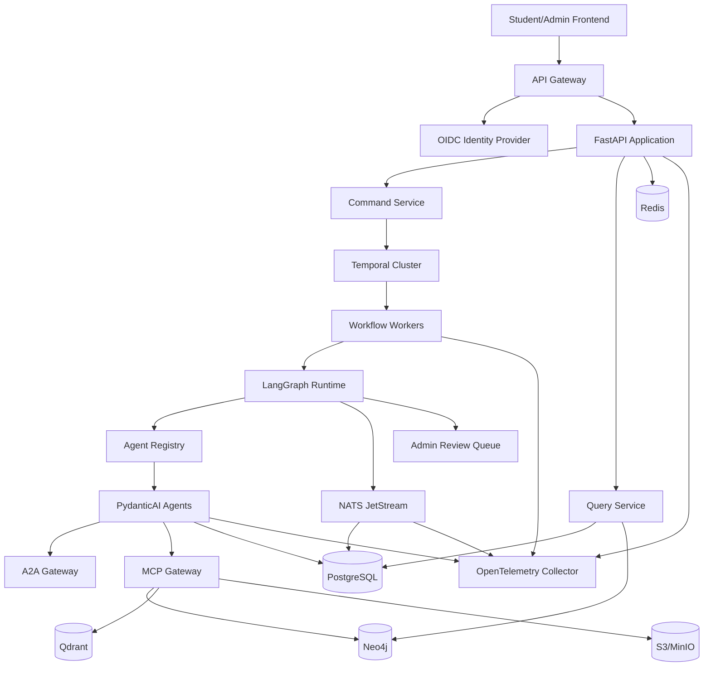
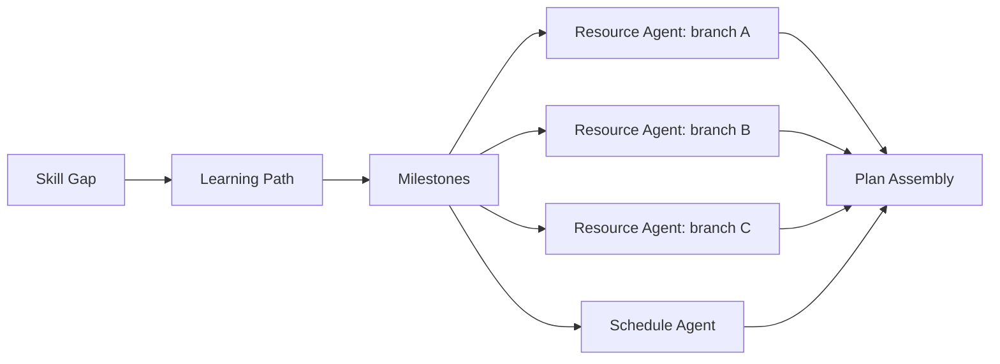

# AstraPath
## Complete Agentic Backend Implementation and Agent Wiring Blueprint

**Document version:** 2.0  
**Architecture status:** Implementation-ready reference  
**Application roles:** **Student** and **Admin only**  
**Agent count:** 20  
**Primary language:** Python  
**Architecture style:** Controlled multi-agent system with durable workflows, typed state, event-driven communication, A2A interoperability, and MCP tool access

---

# 1. Purpose

This document defines how to build the complete backend of AstraPath as a genuine agentic system rather than a collection of independent chatbot prompts.

It covers:

- The two-role authorization model
- All 20 agent implementations
- Agent runtime and orchestration
- Agent-to-agent communication
- A2A Agent Cards, tasks, messages, artifacts, streaming, and security
- MCP-based tool and knowledge access
- LangGraph cognitive workflows
- PydanticAI typed agents and outputs
- Temporal durable business workflows
- Event-driven wiring
- Shared state, memory, persistence, retries, and idempotency
- API, database, retrieval, graph, storage, and notification services
- Human approval using the Admin role
- Testing, observability, deployment, and implementation phases

---

# 2. Fixed Role Model

AstraPath has exactly two application roles.

## 2.1 Student

The Student can:

- Register and complete onboarding
- Create, edit, pause, resume, or close personal goals
- Complete diagnostics and assessments
- View and approve generated plans
- Edit availability and preferences
- Start focus sessions
- Ask the tutor questions
- Upload evidence
- View progress, mastery, risks, and plan versions
- Approve or reject major replanning proposals
- Report incorrect recommendations
- Control allowed notifications and data use
- Request deletion or export of personal data

The Student cannot:

- View another student
- Modify global competencies, resources, prompts, policies, or models
- Access raw agent traces containing protected system information
- Approve their own flagged integrity case
- Change system-wide thresholds

## 2.2 Admin

The Admin combines platform administration, academic oversight, content governance, and exceptional human review.

The Admin can:

- View students according to assigned administrative scope
- Review flagged goals, assessments, evidence, risks, and replans
- Manage competency ontology and prerequisite relationships
- Manage resource catalog and assessment templates
- Manage agent configuration, prompts, models, tools, and protocol endpoints
- Review workflow runs, failures, traces, and audit logs
- Configure policies, thresholds, consent behavior, and feature flags
- Correct corrupted state through controlled repair workflows
- Suspend unsafe content or compromised agent endpoints
- View aggregated analytics
- Export operational reports

The Admin must not:

- Silently change a student’s core goal
- Access private tutor or focus-session content without a recorded policy reason
- bypass audit logging
- Directly edit immutable event history
- Mark uncertain integrity allegations as proven without review evidence

## 2.3 Authorization Matrix

| Capability | Student | Admin |
|---|---:|---:|
| Manage own profile | Yes | Scoped support only |
| Create own goal | Yes | No impersonation |
| Approve own plan | Yes | Review exception only |
| View own agent explanations | Yes | Yes when authorized |
| View all platform configuration | No | Yes |
| Manage knowledge base | No | Yes |
| Review flagged evidence | No | Yes |
| Manage prompts and models | No | Yes |
| View operational traces | No | Yes |
| Change policy thresholds | No | Yes |
| Export own data | Yes | Scoped administrative export |
| Delete immutable audit history | No | No |

---

# 3. Architectural Decision

Use a **hybrid architecture** because no single framework should own every concern.

## 3.1 Framework Responsibilities

| Concern | Selected Technology | Why |
|---|---|---|
| HTTP API | FastAPI | Typed asynchronous APIs, OpenAPI, dependency injection, WebSockets |
| Data contracts | Pydantic v2 | Runtime validation, JSON Schema, typed agent input/output |
| Agent implementation | PydanticAI | Typed dependencies, structured outputs, tools, retries, usage limits |
| Cognitive graph | LangGraph | Shared state, nodes, conditional edges, checkpointing, interrupts |
| Durable long workflow | Temporal | Crash-resilient workflows, retries, timers, signals, human waiting |
| External agent interoperability | A2A Protocol 1.0 | Discovery, delegation, tasks, messages, artifacts, streaming |
| External tools and context | MCP 2026-07-28 | Standard tool/resource interface using a stateless protocol core |
| Event bus | NATS JetStream | Lightweight request/reply plus persisted streams and consumers |
| Event envelope | CloudEvents-compatible JSON | Consistent metadata and event routing |
| Database | PostgreSQL | Transactional source of truth |
| Knowledge graph | Neo4j | Prerequisites, competencies, goals, dependencies |
| Vector retrieval | Qdrant | Semantic retrieval with metadata filters |
| Cache and locks | Redis | Cache, rate limits, ephemeral state, distributed locks |
| Object storage | MinIO or S3 | Evidence, exports, generated artifacts |
| Observability | OpenTelemetry | Unified traces, metrics, and logs |
| Metrics and dashboards | Prometheus + Grafana | Runtime and product monitoring |
| Errors | Sentry-compatible service | Exception grouping and release tracking |
| Authentication | OIDC/OAuth 2.1 provider | Central identity and short-lived tokens |
| Deployment | Docker, then Kubernetes | Reproducible local and scalable production runtime |

## 3.2 Separation of Responsibilities

```text
FastAPI
  receives user commands and exposes read models

Temporal
  owns long-running business process durability

LangGraph
  owns bounded cognitive routing inside a workflow activity

PydanticAI
  implements individual typed LLM agents and tool calls

A2A
  connects independently deployed agent services

MCP
  connects agents to tools, databases, search, files, and sandboxes

NATS JetStream
  distributes domain events and operational events

PostgreSQL
  remains the transactional source of truth
```

## 3.3 Do Not Use Every Protocol Everywhere

- Use direct typed Python calls inside one process.
- Use NATS events for decoupled internal services.
- Use A2A when an agent is independently deployable, remotely owned, or must advertise capabilities.
- Use MCP when an agent needs a tool, resource, prompt, database interface, search interface, or sandbox.
- Use Temporal signals for workflow approvals and long waits.
- Do not expose database credentials directly to any LLM agent.

---

# 4. Agentic Behavior Requirements

An AstraPath component is an agent only when it can:

1. Interpret a goal within a bounded domain.
2. Select among approved actions or tools.
3. Maintain or receive relevant state.
4. Produce typed output.
5. Explain important decisions.
6. Detect uncertainty.
7. Request additional input or human review.
8. Stop when policy, budget, or loop limits are reached.
9. Never bypass authorization.
10. Emit traceable evidence and events.

Agents are not permitted to create arbitrary tools, alter policies, or execute unrestricted code.

---

# 5. Complete 20-Agent Registry

## Agent 1 — Student Profile Agent

**Implementation class:** `StudentProfileAgent`  
**Execution mode:** Hybrid deterministic + LLM extraction

### Purpose

Build and maintain the minimum useful learner profile for planning and personalization.

### Required Inputs

- Student onboarding answers
- Availability
- Device and access constraints
- Learning preferences
- Optional uploaded profile evidence

### Typed Outputs

- `StudentProfileSnapshot`
- `ProfileCompletenessReport`
- `ConsentScope`

### Approved Tools

- `profile_repository`
- `document_parser_mcp`
- `calendar_read_mcp`
- `policy_engine`

### Consumed Events

- `student.created`
- `student.profile_update_requested`

### Produced Events

- `student.profile_created`
- `student.profile_updated`

### Human Checkpoint

Admin review only when an upload is unreadable, consent is incomplete, or policy flags a restricted field.

### Implementation Requirements

- Define a dedicated Pydantic input model and output model.
- Use an explicit tool allowlist.
- Include a confidence value from `0.0` to `1.0`.
- Return `assumptions`, `evidence_refs`, `warnings`, and `next_actions`.
- Use an idempotency key for every state-changing run.
- Emit an OpenTelemetry span named `agent.StudentProfileAgent.run`.
- Enforce token, time, retry, and tool-call budgets.
- Never write directly to another agent’s tables.
- Return a proposed state patch; the Supervisor commits approved patches.
- Persist prompt version, model route, input hash, output hash, and policy version.

---

## Agent 2 — Goal Clarification Agent

**Implementation class:** `GoalClarificationAgent`  
**Execution mode:** Agentic dialogue with deterministic validation

### Purpose

Convert a vague ambition into a specific, measurable, bounded, and student-approved goal.

### Required Inputs

- Raw goal statement
- Student profile snapshot
- Target date
- Priority

### Typed Outputs

- `GoalDefinition`
- `SuccessCriteria`
- `ClarificationQuestions`
- `AssumptionList`

### Approved Tools

- `goal_template_retriever`
- `policy_engine`
- `date_calculator`

### Consumed Events

- `goal.draft_created`

### Produced Events

- `goal.clarified`
- `goal.input_required`

### Human Checkpoint

Admin is not involved unless the goal violates platform policy or needs institution-level configuration.

### Implementation Requirements

- Define a dedicated Pydantic input model and output model.
- Use an explicit tool allowlist.
- Include a confidence value from `0.0` to `1.0`.
- Return `assumptions`, `evidence_refs`, `warnings`, and `next_actions`.
- Use an idempotency key for every state-changing run.
- Emit an OpenTelemetry span named `agent.GoalClarificationAgent.run`.
- Enforce token, time, retry, and tool-call budgets.
- Never write directly to another agent’s tables.
- Return a proposed state patch; the Supervisor commits approved patches.
- Persist prompt version, model route, input hash, output hash, and policy version.

---

## Agent 3 — Goal Feasibility Agent

**Implementation class:** `GoalFeasibilityAgent`  
**Execution mode:** Rule engine + planning agent

### Purpose

Evaluate effort, deadline, constraints, competing commitments, and feasible trade-offs.

### Required Inputs

- GoalDefinition
- StudentProfileSnapshot
- Historical pace
- Calendar capacity

### Typed Outputs

- `FeasibilityReport`
- `EffortRange`
- `ScenarioOptions`
- `RiskAssumptions`

### Approved Tools

- `effort_estimator`
- `calendar_capacity_tool`
- `competency_graph_query`

### Consumed Events

- `goal.clarified`
- `goal.scope_changed`
- `student.availability_changed`

### Produced Events

- `goal.feasibility_completed`
- `goal.tradeoff_selection_required`

### Human Checkpoint

Admin reviews only exceptional cases such as platform policy conflicts or repeated invalid estimates.

### Implementation Requirements

- Define a dedicated Pydantic input model and output model.
- Use an explicit tool allowlist.
- Include a confidence value from `0.0` to `1.0`.
- Return `assumptions`, `evidence_refs`, `warnings`, and `next_actions`.
- Use an idempotency key for every state-changing run.
- Emit an OpenTelemetry span named `agent.GoalFeasibilityAgent.run`.
- Enforce token, time, retry, and tool-call budgets.
- Never write directly to another agent’s tables.
- Return a proposed state patch; the Supervisor commits approved patches.
- Persist prompt version, model route, input hash, output hash, and policy version.

---

## Agent 4 — Diagnostic Assessment Agent

**Implementation class:** `DiagnosticAssessmentAgent`  
**Execution mode:** Agentic assessment selection with deterministic coverage checks

### Purpose

Select or generate a short baseline assessment to reduce uncertainty about current ability.

### Required Inputs

- GoalDefinition
- Candidate competencies
- Student history

### Typed Outputs

- `DiagnosticPlan`
- `AssessmentDefinition`
- `CoverageMatrix`

### Approved Tools

- `assessment_bank`
- `question_generator`
- `rubric_validator`
- `content_safety`

### Consumed Events

- `goal.feasibility_completed`
- `diagnostic.requested`

### Produced Events

- `diagnostic.created`
- `diagnostic.skipped_with_reason`

### Human Checkpoint

Admin manages question-bank quality and reviews flagged generated questions.

### Implementation Requirements

- Define a dedicated Pydantic input model and output model.
- Use an explicit tool allowlist.
- Include a confidence value from `0.0` to `1.0`.
- Return `assumptions`, `evidence_refs`, `warnings`, and `next_actions`.
- Use an idempotency key for every state-changing run.
- Emit an OpenTelemetry span named `agent.DiagnosticAssessmentAgent.run`.
- Enforce token, time, retry, and tool-call budgets.
- Never write directly to another agent’s tables.
- Return a proposed state patch; the Supervisor commits approved patches.
- Persist prompt version, model route, input hash, output hash, and policy version.

---

## Agent 5 — Skill-Gap Analysis Agent

**Implementation class:** `SkillGapAnalysisAgent`  
**Execution mode:** Graph reasoning + evidence synthesis

### Purpose

Compare verified current competency with goal requirements and rank missing prerequisites.

### Required Inputs

- GoalDefinition
- Diagnostic results
- Evidence
- Competency ontology

### Typed Outputs

- `SkillGapReport`
- `VerifiedCompetencies`
- `UncertainCompetencies`
- `GapPriorities`

### Approved Tools

- `neo4j_competency_graph`
- `mastery_repository`
- `evidence_repository`

### Consumed Events

- `diagnostic.completed`
- `evidence.verified`
- `goal.requirements_changed`

### Produced Events

- `skill_gap.completed`
- `skill_gap.reassessment_required`

### Human Checkpoint

Admin can correct ontology mappings and approve disputed competency classifications.

### Implementation Requirements

- Define a dedicated Pydantic input model and output model.
- Use an explicit tool allowlist.
- Include a confidence value from `0.0` to `1.0`.
- Return `assumptions`, `evidence_refs`, `warnings`, and `next_actions`.
- Use an idempotency key for every state-changing run.
- Emit an OpenTelemetry span named `agent.SkillGapAnalysisAgent.run`.
- Enforce token, time, retry, and tool-call budgets.
- Never write directly to another agent’s tables.
- Return a proposed state patch; the Supervisor commits approved patches.
- Persist prompt version, model route, input hash, output hash, and policy version.

---

## Agent 6 — Learning Path Architect Agent

**Implementation class:** `LearningPathArchitectAgent`  
**Execution mode:** Graph-constrained planning agent

### Purpose

Create a prerequisite-aware learning graph containing core, optional, practice, revision, and project branches.

### Required Inputs

- SkillGapReport
- GoalDefinition
- FeasibilityReport
- Competency graph

### Typed Outputs

- `LearningPathGraph`
- `CorePath`
- `OptionalBranches`
- `DependencyExplanation`

### Approved Tools

- `neo4j_competency_graph`
- `path_optimizer`
- `goal_template_retriever`

### Consumed Events

- `skill_gap.completed`
- `path.regeneration_requested`

### Produced Events

- `learning_path.created`
- `learning_path.validation_failed`

### Human Checkpoint

Admin handles ontology defects, unsupported goal categories, and disputed mandatory requirements.

### Implementation Requirements

- Define a dedicated Pydantic input model and output model.
- Use an explicit tool allowlist.
- Include a confidence value from `0.0` to `1.0`.
- Return `assumptions`, `evidence_refs`, `warnings`, and `next_actions`.
- Use an idempotency key for every state-changing run.
- Emit an OpenTelemetry span named `agent.LearningPathArchitectAgent.run`.
- Enforce token, time, retry, and tool-call budgets.
- Never write directly to another agent’s tables.
- Return a proposed state patch; the Supervisor commits approved patches.
- Persist prompt version, model route, input hash, output hash, and policy version.

---

## Agent 7 — Milestone Decomposition Agent

**Implementation class:** `MilestoneDecompositionAgent`  
**Execution mode:** Structured planning agent

### Purpose

Convert the learning path into measurable milestones, acceptance criteria, evidence, and dependencies.

### Required Inputs

- LearningPathGraph
- Target date
- Effort ranges
- Assessment policy

### Typed Outputs

- `MilestonePlan`
- `AcceptanceCriteria`
- `EvidenceRequirements`
- `ReviewPoints`

### Approved Tools

- `milestone_template_store`
- `effort_estimator`
- `dependency_validator`

### Consumed Events

- `learning_path.created`

### Produced Events

- `milestones.created`
- `milestones.approval_required`

### Human Checkpoint

Admin only reviews policy-required milestones or malformed generated acceptance criteria.

### Implementation Requirements

- Define a dedicated Pydantic input model and output model.
- Use an explicit tool allowlist.
- Include a confidence value from `0.0` to `1.0`.
- Return `assumptions`, `evidence_refs`, `warnings`, and `next_actions`.
- Use an idempotency key for every state-changing run.
- Emit an OpenTelemetry span named `agent.MilestoneDecompositionAgent.run`.
- Enforce token, time, retry, and tool-call budgets.
- Never write directly to another agent’s tables.
- Return a proposed state patch; the Supervisor commits approved patches.
- Persist prompt version, model route, input hash, output hash, and policy version.

---

## Agent 8 — Resource Curation Agent

**Implementation class:** `ResourceCurationAgent`  
**Execution mode:** Retrieval agent with quality gates

### Purpose

Discover, verify, rank, and bundle learning resources suitable for the student and competency.

### Required Inputs

- Competency node
- Student constraints
- Difficulty
- Language
- Budget

### Typed Outputs

- `ResourceBundle`
- `PrimaryResource`
- `Alternatives`
- `SelectionExplanation`

### Approved Tools

- `resource_catalog_mcp`
- `web_search_mcp`
- `link_validator`
- `license_checker`
- `vector_retriever`

### Consumed Events

- `resource.bundle_requested`
- `resource.replacement_requested`

### Produced Events

- `resource.bundle_created`
- `resource.admin_review_required`

### Human Checkpoint

Admin approves new global resources, removes stale entries, and resolves unsafe or broken-resource flags.

### Implementation Requirements

- Define a dedicated Pydantic input model and output model.
- Use an explicit tool allowlist.
- Include a confidence value from `0.0` to `1.0`.
- Return `assumptions`, `evidence_refs`, `warnings`, and `next_actions`.
- Use an idempotency key for every state-changing run.
- Emit an OpenTelemetry span named `agent.ResourceCurationAgent.run`.
- Enforce token, time, retry, and tool-call budgets.
- Never write directly to another agent’s tables.
- Return a proposed state patch; the Supervisor commits approved patches.
- Persist prompt version, model route, input hash, output hash, and policy version.

---

## Agent 9 — Schedule and Time-Budget Agent

**Implementation class:** `ScheduleTimeBudgetAgent`  
**Execution mode:** Constraint solver + agentic explanation

### Purpose

Fit milestones and tasks into real availability while respecting workload, breaks, buffers, and deadlines.

### Required Inputs

- MilestonePlan
- Availability
- Energy preferences
- Fixed commitments
- Deadline

### Typed Outputs

- `SchedulePlan`
- `CapacityReport`
- `ConflictList`
- `ScheduleAlternatives`

### Approved Tools

- `constraint_solver`
- `calendar_read_mcp`
- `time_zone_service`
- `effort_estimator`

### Consumed Events

- `milestones.created`
- `calendar.changed`
- `schedule.regeneration_requested`

### Produced Events

- `schedule.created`
- `schedule.conflict_detected`

### Human Checkpoint

Admin does not edit private schedules by default; intervention requires a policy reason and audit trail.

### Implementation Requirements

- Define a dedicated Pydantic input model and output model.
- Use an explicit tool allowlist.
- Include a confidence value from `0.0` to `1.0`.
- Return `assumptions`, `evidence_refs`, `warnings`, and `next_actions`.
- Use an idempotency key for every state-changing run.
- Emit an OpenTelemetry span named `agent.ScheduleTimeBudgetAgent.run`.
- Enforce token, time, retry, and tool-call budgets.
- Never write directly to another agent’s tables.
- Return a proposed state patch; the Supervisor commits approved patches.
- Persist prompt version, model route, input hash, output hash, and policy version.

---

## Agent 10 — Daily Action Planning Agent

**Implementation class:** `DailyActionPlanningAgent`  
**Execution mode:** Context-aware planning agent

### Purpose

Choose a small prioritized set of startable tasks for the current day.

### Required Inputs

- SchedulePlan
- ProgressState
- MasteryState
- RiskState
- Daily check-in

### Typed Outputs

- `DailyPlan`
- `MinimumViableDay`
- `StretchTask`
- `PriorityReasons`

### Approved Tools

- `task_repository`
- `priority_engine`
- `calendar_read_mcp`

### Consumed Events

- `day.started`
- `daily_plan.requested`
- `focus_session.completed`

### Produced Events

- `daily_plan.created`
- `daily_plan.updated`

### Human Checkpoint

Admin sees aggregate quality metrics, not private daily details unless policy and authorization allow.

### Implementation Requirements

- Define a dedicated Pydantic input model and output model.
- Use an explicit tool allowlist.
- Include a confidence value from `0.0` to `1.0`.
- Return `assumptions`, `evidence_refs`, `warnings`, and `next_actions`.
- Use an idempotency key for every state-changing run.
- Emit an OpenTelemetry span named `agent.DailyActionPlanningAgent.run`.
- Enforce token, time, retry, and tool-call budgets.
- Never write directly to another agent’s tables.
- Return a proposed state patch; the Supervisor commits approved patches.
- Persist prompt version, model route, input hash, output hash, and policy version.

---

## Agent 11 — Focus Session Coach Agent

**Implementation class:** `FocusSessionCoachAgent`  
**Execution mode:** Streaming conversational agent with strict session state

### Purpose

Guide a bounded focus session, handle blockers, and close with reflection and evidence.

### Required Inputs

- Selected task
- Session mode
- Duration
- Student preferences

### Typed Outputs

- `FocusSessionState`
- `CheckInMessage`
- `SessionOutcome`
- `Reflection`

### Approved Tools

- `timer_service`
- `focus_session_repository`
- `tutor_handoff`
- `notification_service`

### Consumed Events

- `focus_session.started`
- `focus_session.help_requested`

### Produced Events

- `focus_session.progress`
- `focus_session.completed`
- `focus_session.blocked`

### Human Checkpoint

Admin can inspect technical traces and safety flags, not routine private session content.

### Implementation Requirements

- Define a dedicated Pydantic input model and output model.
- Use an explicit tool allowlist.
- Include a confidence value from `0.0` to `1.0`.
- Return `assumptions`, `evidence_refs`, `warnings`, and `next_actions`.
- Use an idempotency key for every state-changing run.
- Emit an OpenTelemetry span named `agent.FocusSessionCoachAgent.run`.
- Enforce token, time, retry, and tool-call budgets.
- Never write directly to another agent’s tables.
- Return a proposed state patch; the Supervisor commits approved patches.
- Persist prompt version, model route, input hash, output hash, and policy version.

---

## Agent 12 — Contextual Tutor Agent

**Implementation class:** `ContextualTutorAgent`  
**Execution mode:** RAG agent with adaptive tutoring policy

### Purpose

Explain, question, hint, debug, and teach using the student’s goal and verified current level.

### Required Inputs

- Student question
- Current competency
- Allowed context
- Tutor mode

### Typed Outputs

- `TutorResponse`
- `Citations`
- `Misconceptions`
- `PracticePrompt`
- `Confidence`

### Approved Tools

- `knowledge_retriever_mcp`
- `code_sandbox_mcp`
- `calculator_mcp`
- `citation_validator`
- `integrity_policy`

### Consumed Events

- `tutor.question_asked`
- `focus_session.blocked`
- `mastery.misconception_detected`

### Produced Events

- `tutor.response_created`
- `tutor.escalation_required`

### Human Checkpoint

Admin reviews safety escalations, hallucination reports, and content-quality disputes.

### Implementation Requirements

- Define a dedicated Pydantic input model and output model.
- Use an explicit tool allowlist.
- Include a confidence value from `0.0` to `1.0`.
- Return `assumptions`, `evidence_refs`, `warnings`, and `next_actions`.
- Use an idempotency key for every state-changing run.
- Emit an OpenTelemetry span named `agent.ContextualTutorAgent.run`.
- Enforce token, time, retry, and tool-call budgets.
- Never write directly to another agent’s tables.
- Return a proposed state patch; the Supervisor commits approved patches.
- Persist prompt version, model route, input hash, output hash, and policy version.

---

## Agent 13 — Assessment Generation Agent

**Implementation class:** `AssessmentGenerationAgent`  
**Execution mode:** Generation agent with blueprint and rubric validators

### Purpose

Create diagnostic, formative, summative, project, recall, and interview assessments aligned to competencies.

### Required Inputs

- Competency objectives
- Target level
- Assessment type
- Integrity constraints

### Typed Outputs

- `AssessmentDefinition`
- `QuestionSet`
- `Rubric`
- `CoverageMatrix`
- `AnswerKey`

### Approved Tools

- `assessment_bank`
- `question_generator`
- `rubric_validator`
- `duplicate_detector`

### Consumed Events

- `assessment.requested`
- `milestone.assessment_due`

### Produced Events

- `assessment.created`
- `assessment.admin_review_required`

### Human Checkpoint

Admin approves flagged assessments and manages templates, banks, rubrics, and prohibited content.

### Implementation Requirements

- Define a dedicated Pydantic input model and output model.
- Use an explicit tool allowlist.
- Include a confidence value from `0.0` to `1.0`.
- Return `assumptions`, `evidence_refs`, `warnings`, and `next_actions`.
- Use an idempotency key for every state-changing run.
- Emit an OpenTelemetry span named `agent.AssessmentGenerationAgent.run`.
- Enforce token, time, retry, and tool-call budgets.
- Never write directly to another agent’s tables.
- Return a proposed state patch; the Supervisor commits approved patches.
- Persist prompt version, model route, input hash, output hash, and policy version.

---

## Agent 14 — Evidence Verification Agent

**Implementation class:** `EvidenceVerificationAgent`  
**Execution mode:** Multimodal verification agent + deterministic scanners

### Purpose

Validate whether uploaded evidence satisfies task and milestone acceptance criteria.

### Required Inputs

- Evidence artifact
- Acceptance criteria
- Rubric
- Prior submissions

### Typed Outputs

- `EvidenceVerificationReport`
- `CriteriaResults`
- `QualityScore`
- `ReviewDecision`

### Approved Tools

- `object_storage`
- `malware_scanner`
- `document_parser_mcp`
- `code_sandbox_mcp`
- `similarity_service`

### Consumed Events

- `evidence.uploaded`

### Produced Events

- `evidence.verified`
- `evidence.resubmission_required`
- `evidence.admin_review_required`

### Human Checkpoint

Admin is the only human reviewer for uncertain evidence and integrity-related cases.

### Implementation Requirements

- Define a dedicated Pydantic input model and output model.
- Use an explicit tool allowlist.
- Include a confidence value from `0.0` to `1.0`.
- Return `assumptions`, `evidence_refs`, `warnings`, and `next_actions`.
- Use an idempotency key for every state-changing run.
- Emit an OpenTelemetry span named `agent.EvidenceVerificationAgent.run`.
- Enforce token, time, retry, and tool-call budgets.
- Never write directly to another agent’s tables.
- Return a proposed state patch; the Supervisor commits approved patches.
- Persist prompt version, model route, input hash, output hash, and policy version.

---

## Agent 15 — Progress Tracking Agent

**Implementation class:** `ProgressTrackingAgent`  
**Execution mode:** Deterministic event processor with explanation generation

### Purpose

Aggregate reliable activity, schedule, milestone, and evidence progress without inflating completion.

### Required Inputs

- Task events
- Session events
- Assessment results
- Evidence reports
- Plan version

### Typed Outputs

- `ProgressSnapshot`
- `ActivityProgress`
- `MilestoneProgress`
- `ScheduleVariance`

### Approved Tools

- `event_store`
- `progress_repository`
- `analytics_engine`

### Consumed Events

- `task.completed`
- `focus_session.completed`
- `assessment.scored`
- `evidence.verified`

### Produced Events

- `progress.updated`
- `milestone.completed_candidate`

### Human Checkpoint

Admin can audit calculations, correct corrupted events, and review platform-wide progress quality.

### Implementation Requirements

- Define a dedicated Pydantic input model and output model.
- Use an explicit tool allowlist.
- Include a confidence value from `0.0` to `1.0`.
- Return `assumptions`, `evidence_refs`, `warnings`, and `next_actions`.
- Use an idempotency key for every state-changing run.
- Emit an OpenTelemetry span named `agent.ProgressTrackingAgent.run`.
- Enforce token, time, retry, and tool-call budgets.
- Never write directly to another agent’s tables.
- Return a proposed state patch; the Supervisor commits approved patches.
- Persist prompt version, model route, input hash, output hash, and policy version.

---

## Agent 16 — Mastery Estimation Agent

**Implementation class:** `MasteryEstimationAgent`  
**Execution mode:** Statistical model + rule gates + LLM qualitative synthesis

### Purpose

Estimate independent competency using multiple evidence types and explicit uncertainty.

### Required Inputs

- Assessment attempts
- Evidence verification
- Recall history
- Tutor misconceptions
- Time decay

### Typed Outputs

- `MasteryEstimate`
- `ConfidenceInterval`
- `WeakSubskills`
- `NextAssessmentRecommendation`

### Approved Tools

- `mastery_model_service`
- `bayesian_tracker`
- `evidence_repository`
- `competency_graph_query`

### Consumed Events

- `assessment.scored`
- `evidence.verified`
- `review.interval_reached`

### Produced Events

- `mastery.updated`
- `mastery.reassessment_required`
- `competency.unlocked`

### Human Checkpoint

Admin reviews model drift, disputed estimates, and calibration dashboards.

### Implementation Requirements

- Define a dedicated Pydantic input model and output model.
- Use an explicit tool allowlist.
- Include a confidence value from `0.0` to `1.0`.
- Return `assumptions`, `evidence_refs`, `warnings`, and `next_actions`.
- Use an idempotency key for every state-changing run.
- Emit an OpenTelemetry span named `agent.MasteryEstimationAgent.run`.
- Enforce token, time, retry, and tool-call budgets.
- Never write directly to another agent’s tables.
- Return a proposed state patch; the Supervisor commits approved patches.
- Persist prompt version, model route, input hash, output hash, and policy version.

---

## Agent 17 — Motivation and Habit Coach Agent

**Implementation class:** `MotivationHabitCoachAgent`  
**Execution mode:** Low-autonomy coaching agent

### Purpose

Support sustainable consistency, reflection, recovery, and self-directed habit changes.

### Required Inputs

- Progress trend
- Student check-in
- Notification preference
- Goal motivation

### Typed Outputs

- `CoachingMessage`
- `ReflectionPrompt`
- `HabitExperiment`
- `NotificationAdjustment`

### Approved Tools

- `reflection_repository`
- `notification_service`
- `preference_repository`
- `safety_policy`

### Consumed Events

- `weekly.reflection_due`
- `risk.low_engagement`
- `student.motivation_help_requested`

### Produced Events

- `coaching.delivered`
- `habit_experiment.created`
- `coaching.opted_out`

### Human Checkpoint

Admin handles safety flags and platform policy; routine coaching remains private.

### Implementation Requirements

- Define a dedicated Pydantic input model and output model.
- Use an explicit tool allowlist.
- Include a confidence value from `0.0` to `1.0`.
- Return `assumptions`, `evidence_refs`, `warnings`, and `next_actions`.
- Use an idempotency key for every state-changing run.
- Emit an OpenTelemetry span named `agent.MotivationHabitCoachAgent.run`.
- Enforce token, time, retry, and tool-call budgets.
- Never write directly to another agent’s tables.
- Return a proposed state patch; the Supervisor commits approved patches.
- Persist prompt version, model route, input hash, output hash, and policy version.

---

## Agent 18 — Risk and Blocker Detection Agent

**Implementation class:** `RiskBlockerDetectionAgent`  
**Execution mode:** Rules + anomaly detection + agentic root-cause analysis

### Purpose

Detect deadline, overload, missing-prerequisite, stagnation, resource, engagement, and technical risks.

### Required Inputs

- ProgressSnapshot
- MasteryState
- Schedule
- Session patterns
- Open blockers

### Typed Outputs

- `RiskReport`
- `Severity`
- `EvidenceRefs`
- `LikelyCauses`
- `InterventionRecommendation`

### Approved Tools

- `risk_rules_engine`
- `anomaly_detector`
- `event_store`
- `deadline_calculator`

### Consumed Events

- `progress.updated`
- `mastery.updated`
- `focus_session.blocked`
- `daily.health_check`

### Produced Events

- `risk.created`
- `risk.updated`
- `risk.admin_review_required`

### Human Checkpoint

Admin reviews high-severity cases, false positives, policy breaches, and system-generated intervention requests.

### Implementation Requirements

- Define a dedicated Pydantic input model and output model.
- Use an explicit tool allowlist.
- Include a confidence value from `0.0` to `1.0`.
- Return `assumptions`, `evidence_refs`, `warnings`, and `next_actions`.
- Use an idempotency key for every state-changing run.
- Emit an OpenTelemetry span named `agent.RiskBlockerDetectionAgent.run`.
- Enforce token, time, retry, and tool-call budgets.
- Never write directly to another agent’s tables.
- Return a proposed state patch; the Supervisor commits approved patches.
- Persist prompt version, model route, input hash, output hash, and policy version.

---

## Agent 19 — Adaptive Replanning Agent

**Implementation class:** `AdaptiveReplanningAgent`  
**Execution mode:** Plan-search agent with deterministic invariants

### Purpose

Propose the smallest plan change that restores feasibility while preserving completed work and the student’s goal.

### Required Inputs

- Current plan
- RiskReport
- ProgressSnapshot
- MasteryState
- Student constraints

### Typed Outputs

- `ReplanProposal`
- `PlanDiff`
- `ImpactAnalysis`
- `AlternativePlans`
- `ApprovalRequirement`

### Approved Tools

- `plan_version_repository`
- `constraint_solver`
- `path_optimizer`
- `schedule_tool`

### Consumed Events

- `risk.created`
- `replan.requested`
- `student.availability_changed`

### Produced Events

- `replan.proposed`
- `replan.student_approval_required`
- `replan.admin_review_required`

### Human Checkpoint

Admin approves only policy-sensitive or system-wide exceptional changes; the student approves personal major changes.

### Implementation Requirements

- Define a dedicated Pydantic input model and output model.
- Use an explicit tool allowlist.
- Include a confidence value from `0.0` to `1.0`.
- Return `assumptions`, `evidence_refs`, `warnings`, and `next_actions`.
- Use an idempotency key for every state-changing run.
- Emit an OpenTelemetry span named `agent.AdaptiveReplanningAgent.run`.
- Enforce token, time, retry, and tool-call budgets.
- Never write directly to another agent’s tables.
- Return a proposed state patch; the Supervisor commits approved patches.
- Persist prompt version, model route, input hash, output hash, and policy version.

---

## Agent 20 — Supervisor and Governance Agent

**Implementation class:** `SupervisorGovernanceAgent`  
**Execution mode:** Deterministic graph controller with bounded agentic routing

### Purpose

Route work, maintain workflow state, enforce policies, resolve conflicts, control loops, and produce the final explainable response.

### Required Inputs

- User request
- Workflow state
- Agent registry
- Policies
- Budget
- Agent outputs

### Typed Outputs

- `SupervisorDecision`
- `AgentInvocationPlan`
- `StatePatch`
- `ApprovalRequest`
- `UserResponse`

### Approved Tools

- `agent_registry`
- `policy_engine`
- `workflow_store`
- `audit_service`
- `model_gateway`
- `admin_queue`

### Consumed Events

- `All workflow commands and high-impact events`

### Produced Events

- `workflow.started`
- `agent.invoked`
- `workflow.paused`
- `workflow.completed`
- `admin.review_requested`

### Human Checkpoint

Admin owns governance configuration, prompt and model approval, incident handling, and exceptional workflow review.

### Implementation Requirements

- Define a dedicated Pydantic input model and output model.
- Use an explicit tool allowlist.
- Include a confidence value from `0.0` to `1.0`.
- Return `assumptions`, `evidence_refs`, `warnings`, and `next_actions`.
- Use an idempotency key for every state-changing run.
- Emit an OpenTelemetry span named `agent.SupervisorGovernanceAgent.run`.
- Enforce token, time, retry, and tool-call budgets.
- Never write directly to another agent’s tables.
- Return a proposed state patch; the Supervisor commits approved patches.
- Persist prompt version, model route, input hash, output hash, and policy version.

---

# 6. Protocol Architecture

## 6.1 Protocol Matrix

| Communication | Protocol | Transport | Use |
|---|---|---|---|
| Browser to API | REST/JSON | HTTPS | Commands and queries |
| Browser live updates | SSE | HTTPS | Workflow progress, agent status, notifications |
| Focus or tutor streaming | WebSocket or SSE | HTTPS | Token and state streaming |
| Internal command | Python call or Temporal activity | In-process/gRPC worker | Strongly typed invocation |
| Internal event | CloudEvents-compatible message | NATS JetStream | Decoupled updates |
| Remote agent call | A2A 1.0 | HTTP/JSON, SSE | Discovery, tasks, delegation |
| Tool/resource call | MCP 2026-07-28 | Stateless HTTP JSON-RPC | Search, files, databases, sandbox |
| Service API schema | OpenAPI 3.1 | HTTPS | Client generation and validation |
| Event schema | AsyncAPI + JSON Schema | NATS | Event documentation |
| Trace propagation | W3C Trace Context | HTTP/NATS | End-to-end correlation |
| Authentication | OIDC/OAuth 2.1 | HTTPS | User and service identity |

## 6.2 A2A Usage

A2A is the contract between independently deployed agents.

Each externally reachable agent exposes:

```text
GET  /.well-known/agent-card.json
POST /a2a
GET  /a2a/tasks/{task_id}
POST /a2a/tasks/{task_id}:cancel
GET  /a2a/tasks/{task_id}/events
```

### Agent Card Example

```json
{
  "name": "astrapath-skill-gap-agent",
  "description": "Analyzes goal requirements and verified student competency.",
  "version": "2.0.0",
  "protocolVersion": "1.0",
  "url": "https://agents.astrapath.example/skill-gap/a2a",
  "capabilities": {
    "streaming": true,
    "pushNotifications": false,
    "stateTransitionHistory": true
  },
  "authentication": {
    "schemes": ["oauth2"],
    "audience": "astrapath-agent-mesh"
  },
  "skills": [
    {
      "id": "analyze_skill_gap",
      "name": "Analyze Skill Gap",
      "description": "Produces a typed gap report from a goal and verified evidence.",
      "inputModes": ["application/json"],
      "outputModes": ["application/json"],
      "tags": ["education", "competency", "planning"]
    }
  ]
}
```

### A2A Task Mapping

| A2A Concept | AstraPath Meaning |
|---|---|
| Agent Card | Agent identity, endpoint, skills, auth, versions |
| Message | Instruction, question, update, or request for input |
| Task | Durable unit of delegated agent work |
| Artifact | Structured report, plan, assessment, or evidence result |
| Context | Goal and workflow identifiers, not unrestricted memory |
| Streaming event | Status, partial artifact, or input-required state |

### A2A Security Rules

- Validate signed Agent Cards for remote agents.
- Pin accepted protocol versions.
- Require service identity and audience-restricted access tokens.
- Enforce per-agent scopes.
- Reject unsigned or unknown agent endpoints.
- Apply request size, rate, and duration limits.
- Never place raw secrets in messages or artifacts.
- Redact private student fields before remote delegation.
- Propagate `traceparent`, `correlation_id`, and `workflow_id`.
- Store the remote Agent Card hash with every run.

## 6.3 MCP Usage

MCP is used for tools and context, not peer-agent delegation.

Recommended MCP servers:

| MCP Server | Exposed Capabilities |
|---|---|
| `knowledge-mcp` | Competency content, approved educational knowledge |
| `resource-catalog-mcp` | Resource search, metadata, quality state |
| `calendar-mcp` | Read availability; writes require explicit confirmation |
| `document-mcp` | Parse uploaded documents and notes |
| `code-sandbox-mcp` | Run tests in isolated containers |
| `assessment-bank-mcp` | Search approved questions and rubrics |
| `analytics-mcp` | Safe aggregate queries |
| `notification-mcp` | Send approved notifications |
| `admin-ops-mcp` | Restricted operational tools for Admin workflows |

### MCP Authorization

- Each agent receives a short-lived scoped token.
- Tool calls are allowed by policy, not solely by prompt.
- High-risk tools return `input_required` or approval-required state.
- Tool results are treated as untrusted input.
- Prompt injection checks run on retrieved content.
- Every tool call stores arguments hash, result hash, duration, and status.

## 6.4 Internal Event Envelope

```json
{
  "specversion": "1.0",
  "id": "01JEVENTID",
  "source": "astrapath.progress-agent",
  "type": "com.astrapath.progress.updated.v1",
  "subject": "students/stu_001/goals/goal_001",
  "time": "2026-07-30T09:45:00+05:30",
  "datacontenttype": "application/json",
  "traceparent": "00-...",
  "data": {
    "workflow_id": "wf_001",
    "student_id": "stu_001",
    "goal_id": "goal_001",
    "plan_version": 4,
    "progress_snapshot_id": "pg_001"
  }
}
```

### Delivery Semantics

- Assume at-least-once delivery.
- Every consumer must be idempotent.
- Use an inbox table to reject duplicate event IDs.
- Use an outbox table to publish only committed database changes.
- Dead-letter messages after configured retries.
- Replay events into projection tables, never directly into mutable source tables.

---

# 7. Logical Backend Architecture



---

# 8. Runtime Boundaries

## 8.1 API Process

Responsibilities:

- Authenticate Student or Admin
- Validate request
- Apply coarse authorization
- Create command record
- Start or signal Temporal workflow
- Return workflow identifier
- Stream status through SSE
- Serve read models

It must not run long LLM workflows directly.

## 8.2 Temporal Worker

Responsibilities:

- Durable workflow execution
- Retries and backoff
- Timers
- Waiting for Student/Admin input
- Cancellation
- Compensation
- Workflow versioning

## 8.3 LangGraph Runtime

Responsibilities:

- Shared cognitive state
- Agent routing
- Conditional branches
- Parallel agent calls
- Checkpoints
- Interrupt before high-impact actions
- Bounded loops

## 8.4 Agent Services

An agent may begin in-process and later be extracted behind A2A. The domain contract remains unchanged.

## 8.5 Event Consumers

Consumers maintain:

- Progress projections
- Notification projections
- Risk projections
- Admin review queues
- Analytics
- Search indexes

---

# 9. Repository Structure

```text
astrapath-backend/
├── pyproject.toml
├── uv.lock
├── docker-compose.yml
├── Makefile
├── .env.example
├── apps/
│   ├── api/
│   │   ├── main.py
│   │   ├── middleware/
│   │   ├── dependencies/
│   │   ├── routes/
│   │   │   ├── student/
│   │   │   ├── admin/
│   │   │   ├── workflows.py
│   │   │   └── streaming.py
│   │   └── exception_handlers.py
│   ├── worker/
│   │   ├── temporal_worker.py
│   │   ├── activities/
│   │   └── workflows/
│   ├── event_consumer/
│   │   ├── main.py
│   │   └── handlers/
│   └── a2a_gateway/
│       ├── main.py
│       ├── agent_cards/
│       └── routes/
├── agents/
│   ├── base/
│   │   ├── contracts.py
│   │   ├── context.py
│   │   ├── result.py
│   │   ├── budgets.py
│   │   └── exceptions.py
│   ├── registry.py
│   ├── supervisor/
│   ├── profile/
│   ├── goal_clarification/
│   ├── feasibility/
│   ├── diagnostic/
│   ├── skill_gap/
│   ├── learning_path/
│   ├── milestone/
│   ├── resource/
│   ├── schedule/
│   ├── daily_plan/
│   ├── focus/
│   ├── tutor/
│   ├── assessment/
│   ├── evidence/
│   ├── progress/
│   ├── mastery/
│   ├── motivation/
│   ├── risk/
│   └── replanning/
├── orchestration/
│   ├── langgraph/
│   │   ├── state.py
│   │   ├── nodes.py
│   │   ├── routers.py
│   │   ├── checkpoints.py
│   │   └── graphs/
│   ├── temporal/
│   │   ├── workflows/
│   │   ├── activities/
│   │   └── signals.py
│   └── supervisor/
├── protocols/
│   ├── a2a/
│   │   ├── client.py
│   │   ├── server.py
│   │   ├── cards.py
│   │   ├── security.py
│   │   └── mappings.py
│   ├── mcp/
│   │   ├── clients.py
│   │   ├── tool_policy.py
│   │   └── servers/
│   ├── events/
│   │   ├── envelope.py
│   │   ├── publisher.py
│   │   ├── consumer.py
│   │   └── schemas/
│   └── api/
│       └── openapi/
├── domain/
│   ├── student/
│   ├── goals/
│   ├── competencies/
│   ├── plans/
│   ├── tasks/
│   ├── assessments/
│   ├── evidence/
│   ├── progress/
│   ├── mastery/
│   ├── risks/
│   ├── approvals/
│   └── audit/
├── application/
│   ├── commands/
│   ├── queries/
│   ├── handlers/
│   ├── policies/
│   └── dto/
├── infrastructure/
│   ├── postgres/
│   ├── neo4j/
│   ├── qdrant/
│   ├── redis/
│   ├── object_storage/
│   ├── nats/
│   ├── temporal/
│   ├── models/
│   ├── auth/
│   └── observability/
├── knowledge/
│   ├── ontology/
│   ├── prompts/
│   ├── policies/
│   ├── assessment_blueprints/
│   └── resource_rules/
├── migrations/
├── tests/
│   ├── unit/
│   ├── contract/
│   ├── agent/
│   ├── graph/
│   ├── workflow/
│   ├── protocol/
│   ├── integration/
│   ├── security/
│   └── end_to_end/
├── evaluations/
├── scripts/
└── docs/
```

---

# 10. Core Typed Contracts

## 10.1 Agent Context

```python
from datetime import datetime
from typing import Any, Literal
from pydantic import BaseModel, Field

Role = Literal["student", "admin"]

class AgentIdentity(BaseModel):
    agent_id: str
    agent_name: str
    version: str
    deployment: str
    a2a_card_hash: str | None = None

class AgentBudget(BaseModel):
    max_runtime_seconds: int = 45
    max_model_requests: int = 4
    max_tool_calls: int = 8
    max_input_tokens: int = 24_000
    max_output_tokens: int = 4_000

class AgentContext(BaseModel):
    workflow_id: str
    correlation_id: str
    causation_id: str | None = None
    actor_id: str
    actor_role: Role
    student_id: str
    goal_id: str | None = None
    plan_version: int | None = None
    policy_version: str
    consent_scopes: set[str] = Field(default_factory=set)
    locale: str = "en-IN"
    timezone: str = "Asia/Kolkata"
    request_time: datetime
    budget: AgentBudget
    metadata: dict[str, Any] = Field(default_factory=dict)
```

## 10.2 Agent Result

```python
class StatePatch(BaseModel):
    aggregate_type: str
    aggregate_id: str
    expected_version: int
    operations: list[dict[str, Any]]

class AgentResult(BaseModel):
    agent: AgentIdentity
    status: Literal[
        "completed",
        "input_required",
        "student_approval_required",
        "admin_review_required",
        "blocked",
        "failed"
    ]
    confidence: float = Field(ge=0.0, le=1.0)
    summary: str
    data: dict[str, Any]
    assumptions: list[str] = Field(default_factory=list)
    evidence_refs: list[str] = Field(default_factory=list)
    warnings: list[str] = Field(default_factory=list)
    next_actions: list[str] = Field(default_factory=list)
    proposed_patches: list[StatePatch] = Field(default_factory=list)
    user_visible_explanation: str
```

## 10.3 Base Agent Protocol

```python
from typing import Generic, Protocol, TypeVar

InputT = TypeVar("InputT", bound=BaseModel)
OutputT = TypeVar("OutputT", bound=BaseModel)

class AgentProtocol(Protocol, Generic[InputT, OutputT]):
    name: str
    version: str

    async def execute(
        self,
        context: AgentContext,
        input_data: InputT
    ) -> AgentResult:
        ...
```

---

# 11. PydanticAI Agent Implementation Pattern

```python
from dataclasses import dataclass
from pydantic import BaseModel, Field
from pydantic_ai import Agent, RunContext, UsageLimits

class GoalClarificationInput(BaseModel):
    raw_goal: str
    target_date: str | None
    profile_summary: dict

class GoalDefinition(BaseModel):
    title: str
    statement: str
    goal_type: str
    target_date: str | None
    success_criteria: list[str]
    mandatory_outcomes: list[str]
    optional_outcomes: list[str]
    assumptions: list[str]
    clarity_score: float = Field(ge=0, le=1)

@dataclass
class GoalClarificationDependencies:
    goal_template_retriever: object
    policy_engine: object
    audit_service: object

goal_clarification_llm = Agent(
    model="configured:reasoning-medium",
    name="goal_clarification_agent",
    deps_type=GoalClarificationDependencies,
    output_type=GoalDefinition,
    instructions=(
        "Clarify the student's goal without changing its intent. "
        "Return measurable success criteria. State assumptions. "
        "Never guarantee an examination score, admission, or job."
    ),
    retries=2,
)

@goal_clarification_llm.tool
async def retrieve_goal_templates(
    ctx: RunContext[GoalClarificationDependencies],
    goal_type: str
) -> list[dict]:
    return await ctx.deps.goal_template_retriever.search(goal_type)

async def run_goal_clarification(
    deps: GoalClarificationDependencies,
    request: GoalClarificationInput,
) -> GoalDefinition:
    result = await goal_clarification_llm.run(
        request.model_dump_json(),
        deps=deps,
        usage_limits=UsageLimits(
            request_limit=4,
            tool_calls_limit=5,
            total_tokens_limit=10_000,
        ),
    )
    return result.output
```

## 11.1 Model Routing

Use logical model names:

```yaml
model_routes:
  extraction_fast:
    primary: provider_a/small-structured
    fallback: provider_b/fast
  reasoning_medium:
    primary: provider_a/medium-reasoning
    fallback: provider_b/pro
  tutor_streaming:
    primary: provider_a/streaming
    fallback: local/qwen
  multimodal_evidence:
    primary: provider_a/vision
    fallback: provider_b/vision
```

Agent code must not hard-code provider-specific names.

---

# 12. Agent Registry

```python
from dataclasses import dataclass
from typing import Callable

@dataclass(frozen=True)
class AgentDescriptor:
    name: str
    version: str
    input_schema: type[BaseModel]
    output_schema: type[BaseModel]
    factory: Callable
    allowed_tools: frozenset[str]
    required_scopes: frozenset[str]
    remote_a2a_url: str | None = None

class AgentRegistry:
    def __init__(self) -> None:
        self._agents: dict[str, AgentDescriptor] = {}

    def register(self, descriptor: AgentDescriptor) -> None:
        if descriptor.name in self._agents:
            raise ValueError(f"Duplicate agent: {descriptor.name}")
        self._agents[descriptor.name] = descriptor

    def get(self, name: str) -> AgentDescriptor:
        try:
            return self._agents[name]
        except KeyError as exc:
            raise LookupError(f"Unknown agent: {name}") from exc

    def list_capabilities(self) -> list[AgentDescriptor]:
        return list(self._agents.values())
```

The registry decides whether invocation is:

- Local typed function
- Temporal activity
- Remote A2A task
- Disabled by feature flag

---

# 13. LangGraph Shared State

```python
from typing import Annotated, Literal, TypedDict
from operator import add

class GoalWorkflowState(TypedDict, total=False):
    workflow_id: str
    student_id: str
    goal_id: str
    command: dict
    profile: dict
    goal_definition: dict
    feasibility: dict
    diagnostic: dict
    skill_gap: dict
    learning_path: dict
    milestones: list[dict]
    schedule: dict
    risks: list[dict]
    proposed_replan: dict
    approvals: dict
    agent_messages: Annotated[list[dict], add]
    errors: Annotated[list[dict], add]
    next_route: Literal[
        "profile", "clarify", "feasibility", "diagnostic",
        "skill_gap", "path", "milestones", "schedule",
        "student_approval", "admin_review", "complete"
    ]
```

## 13.1 Goal Creation Graph

```python
from langgraph.graph import StateGraph, START, END

builder = StateGraph(GoalWorkflowState)

builder.add_node("load_profile", load_profile_node)
builder.add_node("clarify_goal", clarify_goal_node)
builder.add_node("check_feasibility", feasibility_node)
builder.add_node("build_diagnostic", diagnostic_node)
builder.add_node("analyze_skill_gap", skill_gap_node)
builder.add_node("build_learning_path", learning_path_node)
builder.add_node("create_milestones", milestone_node)
builder.add_node("create_schedule", schedule_node)
builder.add_node("await_student_approval", student_approval_node)
builder.add_node("await_admin_review", admin_review_node)
builder.add_node("commit_plan", commit_plan_node)

builder.add_edge(START, "load_profile")
builder.add_edge("load_profile", "clarify_goal")
builder.add_conditional_edges(
    "clarify_goal",
    route_after_clarification,
    {
        "input_required": END,
        "continue": "check_feasibility",
        "admin_review": "await_admin_review",
    },
)
builder.add_conditional_edges(
    "check_feasibility",
    route_after_feasibility,
    {
        "student_tradeoff": END,
        "continue": "build_diagnostic",
        "admin_review": "await_admin_review",
    },
)
builder.add_edge("build_diagnostic", "analyze_skill_gap")
builder.add_edge("analyze_skill_gap", "build_learning_path")
builder.add_edge("build_learning_path", "create_milestones")
builder.add_edge("create_milestones", "create_schedule")
builder.add_edge("create_schedule", "await_student_approval")
builder.add_edge("await_student_approval", "commit_plan")
builder.add_edge("commit_plan", END)

goal_creation_graph = builder.compile(checkpointer=checkpoint_store)
```

## 13.2 Supervisor Routing Rules

The LLM may recommend a route, but deterministic policy validates it.

```python
def validate_route(
    proposed_route: str,
    state: GoalWorkflowState,
    policy: WorkflowPolicy,
) -> str:
    allowed = policy.allowed_routes(current_state=state["next_route"])

    if proposed_route not in allowed:
        return "admin_review"

    if len(state.get("agent_messages", [])) > policy.max_agent_steps:
        return "admin_review"

    if state.get("errors") and policy.stop_on_error:
        return "admin_review"

    return proposed_route
```

---

# 14. Temporal Durable Workflow

Use Temporal around LangGraph when a process may:

- Wait hours or days for Student approval
- Wait for Admin review
- Retry external services
- Run scheduled reviews
- Survive deployment or process failure
- Be cancelled or paused

```python
from datetime import timedelta
from temporalio import workflow

@workflow.defn
class CreateGoalWorkflow:
    def __init__(self) -> None:
        self.student_decision: dict | None = None
        self.admin_decision: dict | None = None
        self.cancelled = False

    @workflow.signal
    async def submit_student_decision(self, decision: dict) -> None:
        self.student_decision = decision

    @workflow.signal
    async def submit_admin_decision(self, decision: dict) -> None:
        self.admin_decision = decision

    @workflow.signal
    async def cancel(self) -> None:
        self.cancelled = True

    @workflow.run
    async def run(self, command: dict) -> dict:
        result = await workflow.execute_activity(
            run_goal_graph_until_interrupt,
            command,
            start_to_close_timeout=timedelta(minutes=5),
        )

        while result["status"] in {
            "student_approval_required",
            "admin_review_required",
            "input_required",
        }:
            if result["status"] == "student_approval_required":
                await workflow.wait_condition(
                    lambda: self.student_decision is not None or self.cancelled
                )
                decision = self.student_decision
                self.student_decision = None
            else:
                await workflow.wait_condition(
                    lambda: self.admin_decision is not None or self.cancelled
                )
                decision = self.admin_decision
                self.admin_decision = None

            if self.cancelled:
                return {"status": "cancelled"}

            result = await workflow.execute_activity(
                resume_goal_graph,
                {"checkpoint": result["checkpoint"], "decision": decision},
                start_to_close_timeout=timedelta(minutes=5),
            )

        return result
```

---

# 15. Supervisor Implementation

The Supervisor must have two parts.

## 15.1 Deterministic Governance Controller

Responsibilities:

- Authorization
- Route allowlist
- Budget checks
- Loop limits
- Protocol selection
- State-version checks
- Approval requirements
- Tool authorization
- Commit or reject state patch

## 15.2 Bounded Reasoning Agent

Responsibilities:

- Interpret user intent
- Select relevant agent capability
- Resolve non-safety recommendation conflicts
- Summarize final result
- Explain decisions

The reasoning agent never directly commits data.

```python
class SupervisorService:
    def __init__(
        self,
        registry: AgentRegistry,
        policy_engine,
        workflow_store,
        audit_service,
    ):
        self.registry = registry
        self.policy_engine = policy_engine
        self.workflow_store = workflow_store
        self.audit_service = audit_service

    async def invoke(
        self,
        agent_name: str,
        context: AgentContext,
        payload: BaseModel,
    ) -> AgentResult:
        descriptor = self.registry.get(agent_name)

        self.policy_engine.authorize_agent_call(
            actor_role=context.actor_role,
            required_scopes=descriptor.required_scopes,
            consent_scopes=context.consent_scopes,
        )

        if descriptor.remote_a2a_url:
            result = await invoke_a2a_agent(descriptor, context, payload)
        else:
            result = await descriptor.factory().execute(context, payload)

        validated = descriptor.output_schema.model_validate(result.data)
        result.data = validated.model_dump()

        self.policy_engine.validate_agent_result(result, context)
        await self.audit_service.record_agent_run(context, result)
        return result
```

---

# 16. Agent-to-Agent Invocation

## 16.1 Local Invocation

Use local invocation when:

- Same repository and process
- Low latency required
- No independent scaling requirement
- Same trust boundary

## 16.2 A2A Invocation

Use A2A when:

- Agent is independently deployed
- Agent is owned by another internal team
- Different language or framework is used
- Independent scaling or versioning is required
- External partner agent is approved

```python
async def invoke_a2a_agent(descriptor, context, payload):
    card = await a2a_card_cache.get_verified(descriptor.remote_a2a_url)

    token = await service_token_provider.issue(
        audience=card.authentication.audience,
        scopes=list(descriptor.required_scopes),
    )

    task = await a2a_client.create_task(
        url=card.url,
        protocol_version="1.0",
        skill=descriptor.name,
        message={
            "role": "user",
            "parts": [{
                "type": "data",
                "data": {
                    "context": context.model_dump(mode="json"),
                    "payload": payload.model_dump(mode="json"),
                },
            }],
        },
        headers={
            "Authorization": f"Bearer {token}",
            "traceparent": current_traceparent(),
            "X-Correlation-ID": context.correlation_id,
        },
    )

    return await a2a_client.wait_for_typed_artifact(
        task_id=task.id,
        output_schema=descriptor.output_schema,
        timeout_seconds=context.budget.max_runtime_seconds,
    )
```

## 16.3 Agent Handoff Rules

An agent may:

- Delegate a bounded subtask
- Request another agent’s typed artifact
- Return control to the Supervisor
- Request input
- Request Student approval
- Request Admin review

An agent may not:

- Create recursive unbounded delegation
- Directly call itself
- Invoke an unregistered agent
- Pass unrestricted full student memory
- Bypass the Supervisor for a state change

---

# 17. MCP Tool Gateway

```python
class MCPToolGateway:
    def __init__(self, clients, policy_engine, audit_service):
        self.clients = clients
        self.policy_engine = policy_engine
        self.audit_service = audit_service

    async def call(
        self,
        *,
        agent_name: str,
        server_name: str,
        tool_name: str,
        arguments: dict,
        context: AgentContext,
    ) -> dict:
        self.policy_engine.authorize_tool(
            agent_name=agent_name,
            server_name=server_name,
            tool_name=tool_name,
            actor_role=context.actor_role,
            consent_scopes=context.consent_scopes,
        )

        safe_arguments = redact_for_tool(arguments, tool_name)
        result = await self.clients[server_name].call_tool(
            tool_name,
            safe_arguments,
            protocol_version="2026-07-28",
        )

        await self.audit_service.record_tool_call(
            context=context,
            agent_name=agent_name,
            server_name=server_name,
            tool_name=tool_name,
            arguments=safe_arguments,
            result=result,
        )
        return sanitize_tool_result(result)
```

## 17.1 Tool Risk Classes

| Class | Example | Approval |
|---|---|---|
| Read-only | Search competency KB | None |
| Private read | Read own calendar | Student consent |
| Limited write | Save reflection | Existing command authorization |
| External communication | Send notification | Policy and preference |
| High-impact write | Change plan deadline | Student approval |
| Admin operation | Disable resource globally | Admin only |
| Code execution | Run evidence tests | Isolated sandbox and quotas |

---

# 18. Workflow Wiring

## 18.1 Goal Creation

```text
Student command
→ Supervisor
→ Profile Agent
→ Goal Clarification Agent
→ Feasibility Agent
→ Diagnostic Agent
→ Student completes diagnostic
→ Skill-Gap Agent
→ Learning Path Agent
→ Milestone Agent
→ Resource Agent in parallel per path node
→ Schedule Agent
→ Student approval
→ Commit plan
→ Daily Planner
```

Parallelizable section:



## 18.2 Daily Planning

```text
Daily trigger or Student request
→ Progress Agent
→ Mastery Agent
→ Risk Agent
→ Daily Planner
→ Student sees plan
→ Focus Agent
→ Tutor Agent when blocked
→ Evidence or task event
→ Progress Agent
```

## 18.3 Assessment

```text
Milestone review due
→ Assessment Agent
→ Student attempt
→ deterministic scorer where possible
→ Evidence Agent for files/code/oral artifacts
→ Progress Agent
→ Mastery Agent
→ unlock next competency or schedule remediation
```

## 18.4 Risk Recovery

```text
Progress/Mastery/Focus events
→ Risk Agent
→ root-cause classification

missing prerequisite → Skill-Gap Agent
resource mismatch   → Resource Agent
concept confusion   → Tutor Agent
low consistency     → Motivation Agent
overload/deadline   → Replanning Agent
technical failure   → Admin review queue

→ Replanning Agent
→ Schedule Agent
→ Student approval
→ commit new plan version
```

## 18.5 Admin Review

```text
Agent result = admin_review_required
→ Temporal workflow pauses
→ Admin review item created
→ Admin sees evidence and recommended actions
→ Admin approves, rejects, edits, or requests more information
→ signed Admin decision signal
→ workflow resumes from checkpoint
```

---

# 19. Data Persistence

## 19.1 Source-of-Truth Tables

- `users`
- `student_profiles`
- `student_profile_versions`
- `goals`
- `goal_versions`
- `competencies`
- `competency_edges`
- `student_competencies`
- `learning_paths`
- `learning_path_versions`
- `milestones`
- `tasks`
- `schedules`
- `focus_sessions`
- `resources`
- `assessments`
- `assessment_attempts`
- `evidence`
- `evidence_reviews`
- `progress_snapshots`
- `mastery_estimates`
- `risks`
- `replan_proposals`
- `approvals`
- `workflow_runs`
- `agent_runs`
- `tool_calls`
- `outbox_events`
- `inbox_events`
- `audit_logs`
- `admin_review_items`

## 19.2 Immutable Event Store

Store domain facts:

- Goal created
- Plan approved
- Task completed
- Assessment submitted
- Evidence verified
- Mastery updated
- Risk created
- Replan approved

Do not use LLM text as the only system of record.

## 19.3 Memory Types

| Memory | Storage | Lifetime |
|---|---|---|
| Request context | Process memory | One request |
| Workflow state | LangGraph checkpoint + Temporal history | Workflow lifetime |
| Student preferences | PostgreSQL | Until changed/deleted |
| Conversation summary | PostgreSQL encrypted field | Configured retention |
| Semantic learning memory | Qdrant with metadata | Until retention/deletion |
| Competency relationship | Neo4j | Versioned knowledge lifetime |
| Agent trace | Telemetry and audit store | Retention policy |

Agents must retrieve only relevant memory using a purpose-bound query.

---

# 20. API Design

## 20.1 Student Endpoints

```text
POST   /v1/student/onboarding
GET    /v1/student/profile
PATCH  /v1/student/profile

POST   /v1/student/goals
GET    /v1/student/goals
GET    /v1/student/goals/{goal_id}
PATCH  /v1/student/goals/{goal_id}
POST   /v1/student/goals/{goal_id}/pause
POST   /v1/student/goals/{goal_id}/resume
POST   /v1/student/goals/{goal_id}/replan
POST   /v1/student/goals/{goal_id}/approvals/{approval_id}

GET    /v1/student/daily-plan
POST   /v1/student/tasks/{task_id}/start
POST   /v1/student/tasks/{task_id}/complete
POST   /v1/student/focus-sessions
PATCH  /v1/student/focus-sessions/{session_id}
POST   /v1/student/tutor/messages
POST   /v1/student/assessments/{assessment_id}/attempts
POST   /v1/student/evidence
GET    /v1/student/progress
GET    /v1/student/mastery
GET    /v1/student/risks
GET    /v1/student/notifications
PATCH  /v1/student/settings
```

## 20.2 Admin Endpoints

```text
GET    /v1/admin/dashboard
GET    /v1/admin/students
GET    /v1/admin/students/{student_id}
GET    /v1/admin/review-items
POST   /v1/admin/review-items/{id}/decision

CRUD   /v1/admin/competencies
CRUD   /v1/admin/resources
CRUD   /v1/admin/assessment-templates
CRUD   /v1/admin/policies
CRUD   /v1/admin/prompts
CRUD   /v1/admin/model-routes
GET    /v1/admin/agents
PATCH  /v1/admin/agents/{agent_id}
GET    /v1/admin/workflows
GET    /v1/admin/workflows/{workflow_id}
POST   /v1/admin/workflows/{workflow_id}/retry
POST   /v1/admin/workflows/{workflow_id}/cancel
GET    /v1/admin/audit
GET    /v1/admin/system-health
GET    /v1/admin/analytics
```

## 20.3 Asynchronous Command Response

```json
{
  "command_id": "cmd_001",
  "workflow_id": "wf_001",
  "status": "accepted",
  "status_url": "/v1/workflows/wf_001",
  "events_url": "/v1/workflows/wf_001/events"
}
```

## 20.4 SSE Event

```text
event: agent_status
id: evt_124
data: {"workflow_id":"wf_001","agent":"SkillGapAnalysisAgent","status":"completed","progress":45}
```

---

# 21. Authorization and Policy Engine

## 21.1 Policy Input

```json
{
  "actor": {"id": "u_1", "role": "student"},
  "resource": {"type": "goal", "student_id": "stu_1"},
  "action": "update",
  "context": {
    "consent_scopes": ["calendar:read"],
    "workflow_id": "wf_1",
    "risk_level": "low"
  }
}
```

## 21.2 Mandatory Rules

- Students access only their own records.
- Admin access is scoped and logged.
- Agent service tokens have no user-interface role.
- Every state change checks aggregate ownership.
- Private conversation access requires policy purpose.
- High-impact changes require Student approval.
- Global changes require Admin.
- Admin cannot erase audit facts.
- Remote agent delegation requires approved Agent Card and data-minimization policy.

---

# 22. Reliability Patterns

## 22.1 Idempotency

Use:

```text
idempotency_key =
actor_id + command_type + client_request_id
```

Store command result and return it for retries.

## 22.2 Transactional Outbox

1. Update aggregate.
2. Insert outbox event in same database transaction.
3. Publisher sends event to NATS.
4. Mark outbox row published.
5. Consumer stores event ID in inbox before handling.

## 22.3 Retry Classes

| Failure | Retry |
|---|---|
| Model timeout | Exponential backoff, alternate model |
| Schema validation | Reflection retry within budget |
| MCP temporary failure | Bounded retry |
| A2A unavailable | Retry then fallback/local or Admin |
| Policy rejection | No retry |
| Invalid input | Request Student input |
| Optimistic lock conflict | Reload and recompute |
| Permanent file corruption | Request resubmission |

## 22.4 Circuit Breakers

Apply to:

- Model providers
- A2A endpoints
- MCP servers
- Notification provider
- Object storage
- Vector database

---

# 23. Observability

Create one distributed trace per user command.

## Span Hierarchy

```text
http.request
└── temporal.workflow
    └── langgraph.run
        ├── supervisor.route
        ├── agent.skill_gap.run
        │   ├── mcp.neo4j.query
        │   └── model.generate
        ├── agent.learning_path.run
        └── state.commit
```

## Required Metrics

- `agent_runs_total`
- `agent_run_duration_seconds`
- `agent_failures_total`
- `agent_input_required_total`
- `agent_admin_review_total`
- `model_tokens_total`
- `model_cost_total`
- `tool_calls_total`
- `a2a_task_duration_seconds`
- `mcp_call_duration_seconds`
- `workflow_duration_seconds`
- `workflow_retries_total`
- `event_consumer_lag`
- `risk_false_positive_rate`
- `plan_acceptance_rate`
- `evidence_review_disagreement_rate`

Never put raw private student content in metric labels.

---

# 24. Prompt and Model Governance

Each prompt record must include:

- Prompt ID
- Agent
- Version
- Status: draft, evaluation, approved, retired
- Instructions
- Output schema version
- Allowed tools
- Safety policy
- Evaluation dataset
- Evaluation result
- Approved by Admin
- Effective date

A model route change should pass regression evaluation before activation.

Use feature flags and percentage rollout for model or prompt changes.

---

# 25. Security Threat Model

## Main Threats

- Prompt injection through uploaded documents
- Cross-student data retrieval
- Remote A2A agent impersonation
- MCP tool privilege escalation
- Malicious code evidence
- Data exfiltration through model output
- Replay attacks
- Forged Admin decision
- Event poisoning
- Model denial of service
- Agent loops
- Insecure direct object references
- Excessive Admin access

## Controls

- Signed and pinned Agent Cards
- OIDC service identity
- Scoped access tokens
- Field-level data minimization
- Retrieval tenant filters
- Sandbox isolation with no default network
- File malware scanning
- Content security policy
- Immutable audit log
- Outbox/inbox event validation
- Request signing for high-risk internal calls
- Approval signatures and version checks
- Tool and model budgets
- Recursion and delegation limits
- Secret manager
- Encryption at rest and in transit

---

# 26. Testing

## 26.1 Unit Tests

- Pydantic schemas
- Policy decisions
- Route validators
- Risk rules
- Progress calculations
- Mastery gates
- Schedule constraints
- State patches
- Idempotency

## 26.2 Agent Tests

For each of 20 agents:

- Correct input
- Missing optional input
- Invalid input
- Low confidence
- Tool failure
- Model failure
- Schema retry
- Policy rejection
- Student input required
- Admin review required
- Prompt injection
- Budget exhaustion

## 26.3 Protocol Tests

- A2A Agent Card validation
- A2A version negotiation
- A2A task lifecycle
- SSE stream reconnect
- MCP tool schema validation
- MCP authorization
- CloudEvent schema
- NATS redelivery
- Duplicate event
- Trace propagation

## 26.4 Workflow Tests

- Full goal creation
- Student rejects feasibility trade-off
- Diagnostic skipped
- Goal plan approved
- Student misses multiple tasks
- Risk leads to replan
- Student rejects replan
- Admin approves evidence
- Admin rejects unsafe resource
- Worker crashes during approval wait
- Remote agent unavailable
- Model provider unavailable
- Event delivered twice

## 26.5 Evaluation Gates

No agent moves to production until it passes:

- Schema validity
- Domain correctness
- Citation or evidence fidelity
- Safety
- Fairness review
- Calibration
- Latency
- Cost budget
- Regression suite

---

# 27. Deployment Architecture

## 27.1 Local Development

Docker Compose services:

```text
api
worker
event-consumer
a2a-gateway
postgres
redis
neo4j
qdrant
minio
nats
temporal
temporal-ui
otel-collector
prometheus
grafana
```

## 27.2 Production

Kubernetes workloads:

- API deployment
- Temporal workers by workflow queue
- Agent workers by workload class
- A2A gateway
- MCP servers
- Event consumers
- Scheduled health and evaluation jobs
- OpenTelemetry Collector
- Ingress and identity proxy

Use separate namespaces or accounts for development, staging, and production.

## 27.3 Scaling

- Scale API by HTTP load.
- Scale Temporal workers by task-queue backlog.
- Scale agent workers by model/tool latency.
- Scale NATS consumers by stream lag.
- Keep PostgreSQL connection pools bounded.
- Partition high-volume progress events by student identifier.
- Cache Agent Cards and MCP discovery metadata with expiry.

---

# 28. Implementation Phases

## Phase 1 — Platform Kernel

Build:

- FastAPI
- OIDC auth
- Student/Admin RBAC
- PostgreSQL and migrations
- Audit log
- Agent contracts
- Registry
- Supervisor skeleton
- Temporal and LangGraph proof of concept

Agents:

- 1, 2, 20

## Phase 2 — Goal Intelligence

Build agents:

- 3, 4, 5, 6, 7

Add:

- Neo4j ontology
- Goal templates
- Diagnostics
- Plan state

## Phase 3 — Planning and Execution

Build agents:

- 8, 9, 10, 11

Add:

- Qdrant
- Resource MCP
- Calendar MCP
- Focus sessions
- Live streaming

## Phase 4 — Learning and Evidence

Build agents:

- 12, 13, 14

Add:

- Tutor RAG
- Assessment bank
- Object storage
- Sandbox MCP

## Phase 5 — Intelligence Feedback Loop

Build agents:

- 15, 16, 17, 18, 19

Add:

- Event projections
- Mastery model
- Risk engine
- Replanning
- Admin review queue

## Phase 6 — Interoperability

Add:

- A2A gateway
- Agent Cards
- Remote-agent conformance tests
- MCP 2026-07-28 servers
- AsyncAPI event documentation

## Phase 7 — Production Hardening

Add:

- Observability
- Security testing
- Prompt/model registry
- Evaluation pipelines
- Backups
- Disaster recovery
- Load tests
- Runbooks

---

# 29. Definition of Done

The backend is implementation-complete when:

- Exactly two application roles exist: Student and Admin.
- All 20 agents implement typed contracts.
- Every high-impact change is controlled by the Supervisor.
- Long workflows survive process restarts.
- A2A agents expose validated Agent Cards.
- MCP tools are scoped and audited.
- NATS consumers are idempotent.
- State writes use versions and audit logs.
- Student and Admin approval workflows function.
- Activity and mastery remain separate.
- Evidence is never accepted solely from self-reported completion.
- Full traces connect API, workflow, agent, model, tool, event, and state commit.
- Security, agent, protocol, and end-to-end test suites pass.
- Every production prompt and model route has an Admin-approved evaluation record.

---

# 30. Official Technology References

The implementation team should pin exact dependency versions in the lock file and verify compatibility during each release.

- LangGraph Graph API: https://docs.langchain.com/oss/python/langgraph/graph-api
- LangGraph workflows and agents: https://docs.langchain.com/oss/python/langgraph/workflows-agents
- PydanticAI overview: https://pydantic.dev/docs/ai/overview/
- PydanticAI multi-agent patterns: https://pydantic.dev/docs/ai/guides/multi-agent-applications/
- A2A Protocol specification: https://a2a-protocol.org/latest/specification/
- MCP specification and release documentation: https://modelcontextprotocol.io/
- Temporal documentation: https://docs.temporal.io/
- FastAPI documentation: https://fastapi.tiangolo.com/
- OpenTelemetry documentation: https://opentelemetry.io/docs/
- NATS documentation: https://docs.nats.io/

---

# 31. Final Backend Recommendation

Start all agents as modules inside a modular monolith, but make every contract extraction-ready.

Use:

```text
PydanticAI for typed individual agents
+ LangGraph for cognitive routing
+ Temporal for durability and approvals
+ NATS JetStream for events
+ A2A 1.0 for independent agent services
+ MCP 2026-07-28 for tools and resources
+ PostgreSQL, Neo4j, Qdrant, Redis, and S3
+ OpenTelemetry for complete traceability
```

This gives AstraPath real agency while preserving deterministic governance, student control, Admin oversight, and production reliability.
